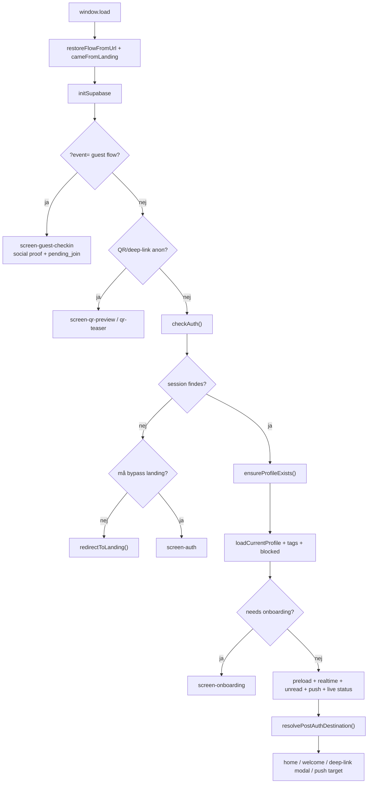
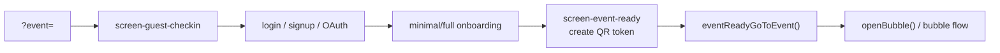
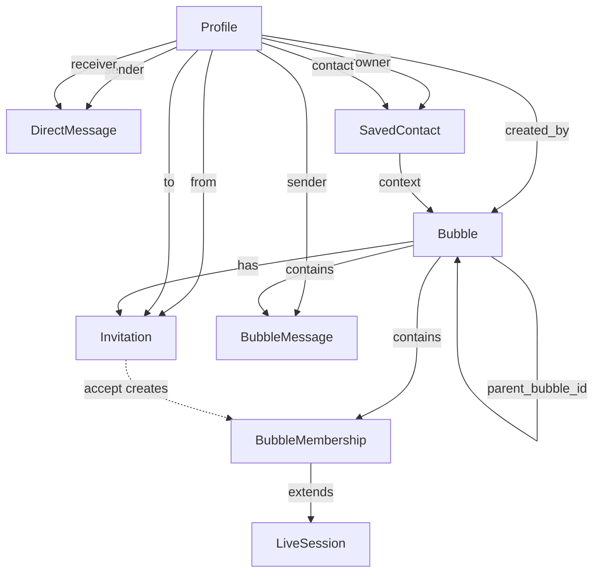

# Bubble — Architecture Map

> **Formål:** Komplet, sandhedsbaseret kortlægning af Bubble's arkitektur — hver fil, hver funktion, hver afhængighed. Grundlag for native rewrite Q1 2027.
>
> **Format:** Levende dokument der vokser over flere sessions. Hver session udvider eksisterende sektioner eller tilføjer nye.
>
> **Status:** PHASE 1 — Foundation (inventory + module call-graph + globals + funktions-katalog)
>
> **Næste fase:** PHASE 2 — Per-fil dybde-dive
>
> **Søsterdokument:** `OPEN-QUESTIONS.md` — åbne spørgsmål Michael løser parallelt

---

## Indholdsfortegnelse

1. [File Inventory](#1-file-inventory)
2. [Module-niveau Call Graph](#2-module-niveau-call-graph)
3. [Globals Catalog](#3-globals-catalog)
4. [Function Catalog per Fil](#4-function-catalog-per-fil)
5. [Patterns & Anti-patterns observeret](#5-patterns--anti-patterns-observeret)

---

## 1. File Inventory

Komplet liste af filer i prod-kodebase per maj 2026 (build v8.17.26):

### JavaScript-filer (20 stk, ~20.152 linjer)

| Fil | Linjer | Rolle |
|---|---|---|
| `b-config.js` | 415 | Konfiguration, globaler, error handling, Supabase init, flow state, app mode |
| `b-utils.js` | 1.139 | Utility-funktioner, dbActions write-lag, GIF picker, escalator scroll |
| `b-i18n.js` | 1.318 | i18n-system (1.084 keys DA+EN), translation helpers |
| `b-auth.js` | 788 | Auth flows, login, signup, sign-out, deep-link modal handler |
| `b-boot.js` | 975 | App startup, screen lifecycle, preloadAllData, navigation hooks |
| `b-navigation.js` | 358 | Navigation primitives, screen switching, _navStack management |
| `b-bubbles.js` | 2.340 | Bubble CRUD, member management, hierarchy, discover |
| `b-chat.js` | 2.455 | DM + Bubble chat (BC), message rendering, reactions, GIF |
| `b-home.js` | 2.452 | Home screen, radar dartboard, top matches, sub-tabs |
| `b-live.js` | 1.189 | Live bubble mode, QR check-in, presence, expiry handling |
| `b-radar.js` | 490 | Radar smart matching algorithm (TF-IDF + sigmoid) |
| `b-realtime.js` | 1.285 | Realtime subscriptions, push notifications, loadMessages |
| `b-onboarding.js` | 1.127 | Onboarding flow, profile setup, tag selection |
| `b-profile.js` | 1.667 | Profile editing, settings, preferences |
| `b-messages.js` | 355 | Unread state management (DM + notifications) |
| `b-notifications.js` | 669 | Notifications screen, badge logic |
| `b-admin.js` | 690 | Admin overlay, debug FAB, moderation |
| `bubble-icons.js` | 68 | SVG icon library |
| `tag-data.js` | 240 | Tags taxonomy (196 tags i 4 kategorier) |
| `sw.js` | 132 | Service Worker for PWA caching |

### HTML/CSS-filer

| Fil | Linjer | Rolle |
|---|---|---|
| `index.html` | 1.800 | Hoved-app HTML med alle screens, modals, sheets |
| `landing.html` | 1.024 | Landing page (DA/EN, GDPR, install guide) |
| `app.css` | 2.294 | Komplet styling system |
| `test-signup-flows.html` | 198 | Smoke test runner |

### Supporting filer

| Fil | Rolle |
|---|---|
| `manifest.json` | PWA manifest |
| `bubble-icon-*.png` | App icons (32, 152, 167, 192, 512) |
| `bubble-logo*.png` | Branding assets |
| `CNAME` | Custom domain (bubbleme.dk) |

### Backend (Supabase)

- **Database:** Postgres med RLS-policies
- **Auth:** Supabase Auth med email/OAuth
- **Realtime:** Postgres CDC + Broadcast channels
- **Storage:** `bubble-files` bucket (public)
- **Edge Functions:** `send-push`, `checkin`, `cleanup-test-user`
- **Custom Domain:** `api.bubbleme.dk` (Supabase Pro)

**Total scope: 25.468 linjer på tværs af alle filer.**

---

## 2. Module-niveau Call Graph

### 2.1 Foundational dependencies (consumed by næsten alle filer)

Disse filer er **fundamenter** — de fleste andre filer afhænger af dem:

```
b-config.js  ←━━ logError, sb, currentUser, currentProfile, appMode,
                 flowGet/Set/Remove, consumeFlow, isUuid, resetAppState
                 ↑ used by 16 filer

b-i18n.js    ←━━ t() translation function
                 ↑ used by 16 filer

b-utils.js   ←━━ escHtml, showToast, bbOpen/Close, dbActions, getAppMode,
                 escalator scroll, GIF picker, escalator-cache
                 ↑ used by 14 filer (showToast specifikt)

b-navigation.js ←━━ goTo, navState, _navStack, screen lifecycle
                    ↑ used by 10 filer
```

### 2.2 Layered architecture (faktisk struktur)

```
┌─────────────────────────────────────────────────────────────┐
│  LAYER 5 — FEATURE SCREENS (UI)                              │
│  b-home.js · b-bubbles.js · b-chat.js · b-profile.js         │
│  b-onboarding.js · b-radar.js · b-live.js · b-admin.js       │
│  b-notifications.js                                          │
└──────────────────────┬──────────────────────────────────────┘
                       │
┌──────────────────────▼──────────────────────────────────────┐
│  LAYER 4 — ORCHESTRATION                                     │
│  b-boot.js (app startup, screen lifecycle)                   │
│  b-auth.js (auth flows, deep-link routing)                   │
└──────────────────────┬──────────────────────────────────────┘
                       │
┌──────────────────────▼──────────────────────────────────────┐
│  LAYER 3 — INFRASTRUCTURE SERVICES                           │
│  b-realtime.js (subscriptions, push)                         │
│  b-messages.js (unread state)                                │
│  b-navigation.js (screen routing)                            │
└──────────────────────┬──────────────────────────────────────┘
                       │
┌──────────────────────▼──────────────────────────────────────┐
│  LAYER 2 — UTILITIES                                         │
│  b-utils.js (UI primitives, dbActions write-lag)             │
│  b-i18n.js (translations)                                    │
│  bubble-icons.js (SVG icons)                                 │
│  tag-data.js (taxonomy)                                      │
└──────────────────────┬──────────────────────────────────────┘
                       │
┌──────────────────────▼──────────────────────────────────────┐
│  LAYER 1 — CORE                                              │
│  b-config.js (Supabase, globals, error handling, app mode)   │
│  sw.js (service worker)                                      │
└─────────────────────────────────────────────────────────────┘
```

### 2.3 Cross-domain afhængigheder (hvem kalder hvem)

Top dependencies (filer med >5 cross-references):

| Function | Source | Used by # filer |
|---|---|---|
| `logError()` | b-config | 16 |
| `t()` | b-i18n | 16 |
| `sb.` (Supabase) | b-config | 15 |
| `showToast()` | b-utils | 14 |
| `escHtml()` | b-utils | 13 |
| `goTo()` | b-navigation | 10 |
| `navState.` | b-navigation | 8 |
| `flowGet/Set` | b-config | 7 |
| `appMode.` | b-config | 6 |

### 2.4 dbActions write-lag adoption

Filer der bruger centralized write-lag via `dbActions.X()`:

- ✅ b-boot.js
- ✅ b-bubbles.js
- ✅ b-chat.js
- ✅ b-home.js
- ✅ b-live.js
- ✅ b-notifications.js
- ✅ b-profile.js
- ✅ b-radar.js
- ✅ b-utils.js (definer)

**Filer der IKKE bruger dbActions:**
- b-admin.js (admin-skrivninger har egne mønstre)
- b-auth.js (auth-skrivninger via supabase.auth)
- b-onboarding.js (delvist — onboarding writes)
- b-realtime.js (realtime publisher)
- b-messages.js (læser kun unread state)

**Q-001 er åben:** Skal b-admin.js, b-onboarding.js og b-realtime.js også migreres til dbActions, eller er deres skrivninger reelt ude af scope (admin-only / auth-only / realtime-only)?

### 2.5 Load-order (script-tags i index.html)

Vanilla JS er afhængig af **fil-ordre** for global-deklarations-tilgængelighed (ingen ES modules). Faktisk script-load-rækkefølge:

```
1.  Supabase SDK (CDN)
2.  qrcodejs (CDN)
3.  Chart.js (CDN)
4.  bubble-icons.js     ← icons først (ingen deps)
5.  tag-data.js         ← taxonomy data
6.  b-i18n.js           ← translations
7.  b-config.js         ← Core: globals, sb, appMode, flowState
8.  b-utils.js          ← Utilities, dbActions
9.  b-auth.js           ← Auth (skriver currentUser/Profile)
10. b-home.js
11. b-bubbles.js
12. b-profile.js
13. b-radar.js
14. b-messages.js       ← unread state
15. b-realtime.js       ← subscriptions
16. b-onboarding.js
17. b-chat.js
18. b-notifications.js
19. b-live.js
20. b-admin.js
21. b-navigation.js     ← navState, goTo
22. b-boot.js           ← App startup (sidste, fordi den initialiserer alt)
```

**Bemærkning:** Ordrer 4-22 er funktionelt korrekt fordi:
- `defer` attribut på alle scripts = de kører efter HTML parse i fil-ordre
- Globaler deklareret med `var` er hoisted til script-niveau
- Cross-fil-funktioner kaldes via "lazy lookup" pattern (kommenteret i b-navigation.js header)
- `b-boot.js` er sidste fil og starter app via `DOMContentLoaded`

**Risiko:** Ny global tilføjet i fil X der bruges af fil Y kan fejle hvis Y indlæses før X. **Lazy lookup** (`if (typeof X === 'function') X()`) er konventionen for at undgå dette.

**Q-002 er åben:** Hvorfor er b-boot.js sidst og IKKE først? (Min antagelse: fordi den initialiserer/orchestrer alle andre moduler — så de skal være loaded før den kan bruge dem. Dette ville være et "main()" pattern.)

---

## 3. Globals Catalog

Cirka 200 top-level variabler på tværs af kodebasen. Jeg har kategoriseret efter formål og synlighed:

### 3.1 KONFIGURATION (constants — ændres aldrig efter init)

**b-config.js:**
- `BUILD_TIMESTAMP` — bygge-dato
- `BUILD_VERSION` — version-string ("v8.17.26")
- `SUPABASE_URL` — backend endpoint
- `SUPABASE_ANON_KEY` — public API key
- `GIPHY_API_KEY` — Tenor GIF API
- `EMAILJS_PUBLIC_KEY`, `EMAILJS_SERVICE_ID`, `EMAILJS_TEMPLATE_ID` — error alert email
- `ERROR_LOG_MAX = 50` — error log circular buffer size
- `ERROR_EMAIL_COOLDOWN = 60000` — 1 email per minut max

**b-live.js:**
- `LIVE_EXPIRE_HOURS = 6` — live bubble lifetime

**b-profile.js:**
- `RADAR_PAGE_SIZE = 25`, `PERSON_BUBBLES_MAX = 5`
- `CHAT_BLOCKED_WORDS` — content moderation list
- `proxColors`, `proxThresholds`, `listRangeLabels` — radar visual constants

**b-radar.js:**
- `MATCH_CAP = 25` — max profiles in radar
- `_sectorMap`, `_lifestageMap`, `_tagClusterMap`, `_lifestageRelated` — match algorithm tuning

**b-onboarding.js:**
- `OB_LIFESTAGE_TAGS`, `OB_INTEREST_TAGS` — onboarding taxonomy
- `OB_BLOCKED_WORDS` — content moderation
- `CUSTOM_TAG_PROMOTE_THRESHOLD = 3` — when custom tag becomes "real"
- `ET_ICONS`, `ET_SECTIONS`, `ET_LS` — edit-tags UI structure

**b-admin.js:**
- `TEST_ACCOUNT_EMAIL = 'test@bubbleme.dk'`

**b-home.js:**
- `SETUP_THRESHOLD = 59` — profile completeness threshold for CTA disappearance
- `SETUP_INTERESTS` — onboarding interests list
- `_setupStepMap` — step-to-section mapping

**b-notifications.js:**
- `NOTIF_TTL` — notification time-to-live config

### 3.2 SESSION STATE (user identitet — set ved login, cleared ved logout)

**b-config.js (declared, written by b-auth.js):**
- `sb` — Supabase client instance (set i `initSupabase()`)
- `currentUser` — Supabase auth user object
- `currentProfile` — profiles row for current user
- `isAnon` — er brugeren guest/anonym?

**b-config.js (declared, used widely):**
- `currentBubble` — *(ser ud til at være sjældent brugt; muligvis dead?)* **Q-003**
- `currentPerson` — sidst åbnede person-sheet profil
- `currentChatUser`, `currentChatName` — DM-modtager (sat af `b-chat.js` via `b-realtime.js`)
- `allBubbles` — cache af alle brugerens bobler

**b-config.js (chip arrays for tag-pickers):**
- `cbChips`, `epChips`, `epDynChips`, `ebChips`, `obChips`, `obDynChips`
- *cb* = create bubble, *ep* = edit profile, *eb* = edit bubble, *ob* = onboarding

**b-live.js:**
- `currentLiveBubble` — live bubble context (synced via `appMode.set('live', ctx)`)

### 3.3 APP MODE (single source of truth, b-config.js)

```javascript
appMode = {
  _mode: 'normal',     // 'normal' | 'live' | 'event' | 'guest'
  _liveCtx: null,      // { bubbleId, bubbleName, memberCount, expiryStr }
  _checkedInIds: [],   // user IDs i live bubble
  // API:
  get(), is(mode), set(mode, ctx), setCheckedInIds(ids), clearLive()
  // Read-only properties:
  live (getter), checkedInIds (getter)
}
```

**Bemærkning:** `appMode.set('live', ctx)` synkroniserer `currentLiveBubble` for legacy-compat. Begge læses i koden.

### 3.4 NAVIGATION STATE (b-navigation.js)

```javascript
navState = {
  screen: null,          // current active screen
  overlay: null,         // active overlay (chat, person-sheet, etc.)
  modal: null,           // active modal
  chatTarget: null,      // DM target user
  bubbleChatId: null,    // active bubble chat
  personSheetId: null,   // open person sheet
  // ...flere
}
```

**Andre nav-globaler:**
- `_activeScreen` — kompat-alias til `navState.screen`
- `_navStack` — history stack for back-navigation
- `_navLock`, `_navPopLock` — race-condition guards
- `_screenHooks` — onEnter/onLeave callbacks per screen
- `_publicScreens` — screens tilgængelige uden auth
- `_navVersion` — incremented på hver navigation

### 3.5 FLOW STATE (b-config.js — localStorage-baseret med 15min TTL)

**Funktioner:**
- `flowGet(key)`, `flowSet(key, value)`, `flowRemove(key)`, `consumeFlow(key)`
- `flowClearAll()` — kun ved eksplicit logout
- `isUuid(s)` — validator for ID-keys

**Prefix:** `bf_` (bubble flow)

**Keys (kendte):**
- `pending_contact` — gemt kontakt der ventede på login
- `pending_join` — pending join-request på bubble
- `event_flow` — i gang med event-onboarding
- `post_tags_destination` — hvor at gå hen efter tag-setup

**Relateret:** `_flowStatePrefix = 'bf_'`, `_flowTTL = 15 * 60 * 1000`

### 3.6 REALTIME STATE (b-realtime.js)

- `_rtState` — 'connected' | 'connecting' | 'disconnected' | 'error'
- `_rtReconnectTimer`, `_rtReconnectAttempt`, `_rtReconnectMax = 10` — reconnect logic
- `_rtChannelStates` — per-channel status tracking
- `_rtSuppressed` — suppress notifications midlertidigt
- `_globalRtChannels[]` — array af aktive subscriptions
- `_radarRefreshTimer`, `_radarScreenActive` — radar-specific subscriptions
- `_liveMembersChannel` — dynamisk kanal for live-bubble check-ins
- `_offlineTimer`, `_offlineCooldown`, `_offlineShown` — offline handling

**Chat-specific (b-realtime.js):**
- `chatSubscription` — DM realtime subscription
- `_messagesLoading` — DM list load state
- `_dmTypingTimer`, `_dmLongPressTimer`, `_dmLongPressId`, `_dmLongPressSelMon`
- `_dmBroadcastTypingTimer`
- `dmEditingId` — i gang med at edit DM

### 3.7 LOCKS (race-condition guards, scattered)

- `_authLock` (b-auth.js) — auth flow guard, 30s timeout
- `_authLockTimer` (b-auth.js)
- `_navLock`, `_navPopLock` (b-navigation.js)
- `_liveLock` (b-live.js) — double check-in guard
- `_bbSubmitLock` (b-bubbles.js) — create/edit/delete bubble
- `_postSubmitLock` (b-chat.js) — post submission
- `_rpSaveLock` (b-radar.js) — radar profile save
- `_saveContactLock` (b-profile.js)
- `_upvoteLock = {}` (b-bubbles.js) — per-bubble upvote guard
- `_filterTimer` (b-bubbles.js) — debounce filter input
- `_renderDartboardTimer` (b-home.js) — debounce render

**Q-004:** Er der en samlet konvention for locks? De ser ud til at følge `_xLock = true; ...; _xLock = false;` pattern, men nogle bruger timeout og andre ikke.

### 3.8 CACHE (data caching, scattered)

- `_savedContactIds`, `_savedContactIdsTs` (b-utils.js) — saved contacts cache med TTL
- `_profileCache = {}` (b-chat.js) — profiles cache for chat
- `_bcPostsCache`, `_bcPostsProfileCache` (b-chat.js) — bubble posts cache
- `_homeDartboardProfiles` (b-home.js) — top profiles cache
- `_allMyBubblesCache` (b-home.js)
- `_myBubbleMemberIds` (b-home.js) — bruges af b-realtime.js for unread nav-dot
- `_dartboardDataLoaded` (b-home.js)
- `proxAllProfiles` (b-profile.js) — proximity profiles cache
- `_blockedUsers` (b-profile.js) — blocked user IDs cache

### 3.9 UI STATE (per-screen, scattered)

**Home (b-home.js):**
- `_homeViewMode = 'all'` — tab toggle
- `_bubbleUnreadSet = {}` — unread bubbles tracking
- `_homeRadarFilter = 'all'`
- `_homeLoading`, `_homeBooting`
- `_bbActiveTab`, `_bbActiveSub`, `_bbAccordionOpen`

**Bubbles (b-bubbles.js):**
- `bubbleUpvotes`, `myUpvotes` — upvote state
- `_discoverLoaded`
- `_memberSheetEl` — DOM ref to member sheet
- `currentEditBubbleId`, `currentQRBubble`
- `_pendingBubbleIcon`
- `inviteBubbleId`, `inviteSelected[]`

**Chat (b-chat.js):**
- `gifPickerMode`, `_gifSearchTimer` — GIF picker state
- `bcBubbleId`, `bcBubbleData`, `bcCurrentMsgId`, `bcEditingId`, `bcMsgHistories`, `bcSubscription`, `bcSending`
- `_bcLivePollTimer`, `_bcActiveTab`, `_bcPrevTab`
- `_bcLongPressTimer`

**Live (b-live.js):**
- `_liveQrStream`, `_liveQrFrame`, `_liveQrFound` — QR scanning state
- `_barcodeDetector`, `_useNativeDetector`
- `_liveQrPending`, `_liveQrResolvedBubble`, `_scannerBubbleId`, `_pendingScanCheckin`
- `_connectStream`, `_connectFrame`, `_connectPending`, `_connectLastUrl`, `_connectLastTime` — connect-via-QR state
- `_connectNativeAttempts`
- `_connectBubbleData`, `_connectBubbleIsEvent`, `_connectProfileId`

**Radar (b-radar.js):**
- `radarCurrentView = 'map'`
- `radarDismissed[]`, `radarPendingRemove`
- `rpCurrentUserId`, `_rpSaveLock`
- `matchPage`, `_tagToCluster`

**Profile (b-profile.js):**
- `proxVisible`, `proxRange = 5`
- `_radarFilter`, `_radarPage`
- `pendingRemoveSavedId`, `pendingRemoveBtn`
- `pendingDeclineInviteId`, `pendingDeclineBtn`
- `_blockConfirm`, `_reportConfirm`

**Onboarding (b-onboarding.js):**
- `_reRunningOnboarding`, `_miniObConsentGiven`, `_obConsentGiven`
- `_abortConfirmed`
- `epSelectedTags[]`, `_epExpandedCats[]`
- `etSelected` (Map), `etCustom`, `etInputVis`, `etOpenSec`, `etLifestage`, `_etPrefix`
- `_selectedInterests` — selected setup interests

**Auth (b-auth.js):**
- `_selectedInterests` (IIFE) — onboarding interests in auth context

**Boot (b-boot.js):**
- `_cameFromLanding` — set hvis ?auth=1 var i URL
- `_qrContactProfile` — QR contact profile pending
- `_eventBubble` — event bubble pending join
- `_analyticsQueue`, `_analyticsFlushTimer`

**Admin (b-admin.js):**
- `_dashChartInstances`, `_dashChartData`, `_dashActiveChart`, `_dashMeta`, `_dashColors`
- `_pendingBanUserId`, `_pendingBanUserName`
- `_adminSearchTimer`
- `_debugErrorCount`, `_debugErrors`, `_debugChannel`, `_debugOverlayOpen`

**Notifications (b-notifications.js):**
- (Sparse top-level state — mest funktion-lokal)

### 3.10 UNREAD STATE (b-messages.js — single source of truth)

```javascript
unreadState = {
  dm: 0,        // unread DM count
  notif: 0,     // unread notification count
  // Methods:
  dmRecount(),    // refresh from DB
  reset(),        // clear on logout
  render(),       // update badges in DOM
  set(field, value)
}
```

**Legacy:**
- `_unreadCount = 0` — old global, ikke længere autoritativ

### 3.11 SUMMERING

| Kategori | Antal globaler (cirka) |
|---|---|
| Konfiguration | 30 |
| Session state | 12 |
| App mode | 1 (objekt) |
| Navigation state | 8 |
| Flow state | 3 |
| Realtime state | 18 |
| Locks | 10+ |
| Cache | 12 |
| UI state | 80+ |
| Unread state | 1 (objekt) |

**Total: ~200 top-level globaler.**

---

## 4. Function Catalog per Fil

### 4.1 Status

Komplet katalog kommer i flere sessions. Denne session dækker **fundamentale filer** (Layer 1-3 i 2.2).

**Strategi:** Foundation først (config, utils, i18n, navigation, realtime, messages) → så orchestration (auth, boot) → så feature-screens.

### 4.2 b-config.js — CORE LAYER (415 linjer, 14 funktioner)

| # | Funktion | Linje | Type | Formål |
|---|---|---|---|---|
| 1 | `getClientState()` | 33 | sync | Snapshot af app-state for diagnostics (sw, screen, mode, flows, rt, push) |
| 2 | `_shortUA()` | 81 | sync | User-agent → kort string ("iOS 17 / Safari") |
| 3 | `loadEmailJS()` | 99 | sync | Lazy-load EmailJS script for error alerts |
| 4 | `sendErrorEmail(entry)` | 109 | sync | Send error via EmailJS (rate-limited, max 1/min) |
| 5 | `logError(context, error, extra)` | 127 | sync | Persist error to local log + Supabase + email alert |
| 6 | `initSupabase()` | 197 | sync | Initialize Supabase client (sets `sb`) |
| 7 | `flowGet(key)` | 228 | sync | Read flow state from localStorage with TTL check |
| 8 | `flowSet(key, value)` | 241 | sync | Write flow state with 15min TTL |
| 9 | `flowRemove(key)` | 247 | sync | Remove flow state |
| 10 | `consumeFlow(key)` | 253 | sync | **Atomic** read-and-clear flow state |
| 11 | `isUuid(s)` | 262 | sync | Validate UUID format (security guard) |
| 12 | `flowClearAll()` | 265 | sync | Clear all flow flags (only on explicit logout) |
| 13 | `registerState(resetFn)` | 282 | sync | Register module's cleanup callback |
| 14 | `resetAppState()` | 286 | sync | Clear ALL session state on logout |

**Plus:** Global error handlers `window.onerror`, `window.onunhandledrejection`. Global `window.viewErrorLog` for debugging.

### 4.3 b-utils.js — UTILITY LAYER (1.139 linjer, 47 funktioner)

#### 4.3.1 UI primitives
| # | Funktion | Linje | Formål |
|---|---|---|---|
| 1 | `getAppMode()` | 15 | Wrapper around `appMode.get()` |
| 2 | `matchLabel(score)` | 24 | Score → label ("Stærkt match", "Godt match", etc.) |
| 3 | `matchBadgeHtml(score)` | 32 | Render match badge HTML |
| 4 | `confirmInput(btn)` | 41 | Visual confirm-state on input button |
| 5 | `initInputConfirmButtons()` | 52 | Wire up all confirm-buttons |
| 6 | `escHtml(s)` | 368 | XSS escape (used 13 places) |
| 7 | `linkify(text)` | 370 | URL → clickable links |
| 8 | `isEmojiOnly(text)` | 375 | Detect single-emoji messages |
| 9 | `safeAvatarImg(url, style)` | 383 | Render avatar with fallback |
| 10 | `bubbleEmoji(type)` | 388 | Type → emoji icon |
| 11 | `bubbleColor(type, alpha)` | 395 | Type → color value |
| 12 | `typeLabel(type)` | 402 | Type → human label |
| 13 | `visIcon(v)` | 411 | Visibility → icon |
| 14 | `renderAvatar(name, color, avatarUrl, size)` | 749 | Full avatar render |
| 15 | `timeAgo(dateStr)` | 582 | Relative time ("2t siden") |

#### 4.3.2 Bottom-sheet system (bb-sheet)
| # | Funktion | Linje | Formål |
|---|---|---|---|
| 16 | `bbOpen(name)` | 196 | Open named sheet |
| 17 | `bbClose(name)` | 203 | Close named sheet |
| 18 | `bbCloseAll()` | 210 | Close ALL sheets |
| 19 | `bbDynOpen(opts)` | 234 | Open dynamic sheet with options |
| 20 | `bbDynClose(overlay)` | 249 | Close dynamic sheet |
| 21 | `bbConfirm(parentEl, options)` | 256 | Inline confirmation pattern |

#### 4.3.3 Modal system (legacy)
| # | Funktion | Linje | Formål |
|---|---|---|---|
| 22 | `openModal(id)` | 177 | Add 'open' class to modal |
| 23 | `closeModal(id)` | 182 | Close modal + cleanup |

#### 4.3.4 Toast notifications
| # | Funktion | Linje | Formål |
|---|---|---|---|
| 24 | `_renderToast(msg, type)` | 290 | Internal render |
| 25 | `showToast(msg, duration)` | 301 | Generic info toast |
| 26 | `showSuccessToast(message)` | 306 | Green success toast |
| 27 | `showWarningToast(message)` | 310 | Yellow warning toast |
| 28 | `showErrorToast(message)` | 314 | Red error toast |
| 29 | `errorToast(context, error)` | 331 | Wrapper: logError + showErrorToast |

#### 4.3.5 Chip / tag-picker pattern
| # | Funktion | Linje | Formål |
|---|---|---|---|
| 30 | `handleChipInput(e, arrayName)` | 109 | Handle keyboard input in chip-picker |
| 31 | `addChipFromBtn(inputId, arrayName)` | 124 | Add chip from button click |
| 32 | `flashConfirmBtn(input)` | 140 | Visual feedback on chip add |
| 33 | `renderChips(arrayName, arr, containerId, inputId)` | 149 | Render chip list |
| 34 | `removeChip(arrayName, index, containerId, inputId)` | 167 | Remove chip from array |

#### 4.3.6 Saved contacts cache
| # | Funktion | Linje | Formål |
|---|---|---|---|
| 35 | `getSavedContactIds(forceRefresh)` | 422 | Async fetch of saved contact IDs (cached) |
| 36 | `clearSavedContactIdsCache()` | 431 | Invalidate cache |
| 37 | `fetchContactAvatarsForBubbles(bubbleIds, savedIds)` | 435 | Fetch avatar URLs for bubbles |
| 38 | `fetchMemberAvatarsForBubbles(bubbleIds, max)` | 458 | Fetch member avatars |
| 39 | `renderAvatarStack(members, totalCount)` | 486 | Stack of avatars UI |

#### 4.3.7 Empty/retry states
| # | Funktion | Linje | Formål |
|---|---|---|---|
| 40 | `showRetryState(elementId, retryFnName, message)` | 503 | Show retry button on failure |
| 41 | `showEmptyState(elementId, iconName, message, ctaText, ctaAction)` | 514 | Empty state with CTA |
| 42 | `skelCards(count)` | 556 | Skeleton loading cards |
| 43 | `skelMessages(count)` | 569 | Skeleton chat messages |

#### 4.3.8 Chat menu (3-dot dropdown)
| # | Funktion | Linje | Formål |
|---|---|---|---|
| 44 | `toggleChatMenu(mode)` | 525 | Toggle 3-dot menu in chat |
| 45 | `closeChatMenu(mode)` | 543 | Close menu |
| 46 | `_closeChatMenuOutside(e)` | 548 | Click-outside handler |

#### 4.3.9 Push notifications (frontend trigger)
| # | Funktion | Linje | Formål |
|---|---|---|---|
| 47 | `sendPush(userId, title, body, data)` | 319 | Trigger push via edge function |

#### 4.3.10 dbActions object (write-lag, line 766)
**Centraliseret write-API. Bruges af 9 filer.**

```javascript
dbActions = {
  saveContact(profileId, source),     // → contacts.insert
  removeContact(profileId),           // → contacts.delete
  joinBubble(bubbleId, source),       // → bubble_members.insert
  leaveBubble(bubbleId),              // → bubble_members.delete
  updateProfile(updates),             // → profiles.update
  sendDM(toId, content, fileUrl?),    // → messages.insert
  sendBubbleMessage(bubbleId, ...),   // → bubble_messages.insert
  reportUser(targetId, reason)        // → reports.insert
}
```

Hver action returnerer: `{ ok, data?, error?, duplicate? }`. Auth-guard, error-handling, tracking — konsistent.

**Q-008:** I `dbActions` finder jeg 8 actions. Men 117 direkte writes findes uden for dette lag. Skal vi inventere de 117 writes systematisk for at se hvilke der mangler i dbActions?

### 4.4 b-i18n.js — TRANSLATION LAYER (1.318 linjer, 5 funktioner)

| # | Funktion | Linje | Formål |
|---|---|---|---|
| 1 | `setLang(lang)` | 9 | Change language ('da' or 'en') |
| 2 | `getLang()` | 15 | Get current language |
| 3 | `_locale()` | 18 | Get JS locale ('da-DK' or 'en-GB') for date formatting |
| 4 | `t(key, vars)` | 20 | **THE** translation function (used 16 places) |
| 5 | `translateStaticUI()` | 31 | Apply translations to all `data-t` attributes |

**Plus:** `_translations` object med 1.084 keys (542 DA + 542 EN).

**Pattern:** UI elementer bruger `data-t="key"` for tekst, `data-t-placeholder="key"` for placeholder, `data-t-aria="key"` for aria-label.

### 4.5 b-navigation.js — NAVIGATION LAYER (358 linjer, ~12 funktioner)

| # | Funktion | Linje | Formål |
|---|---|---|---|
| 1 | `navBack()` | 35 | Pop _navStack and go to previous screen |
| 2 | `_navGoDiscover()` | 168 | Tab shortcut: Bobler → Discover |
| 3 | `_navEnterNotifs()` | 169 | Notifications screen entry hook |
| 4 | `_navLeaveHome()` | 171 | Home screen exit cleanup |
| 5 | `_navLeaveChat()` | 175 | DM chat exit cleanup |
| 6 | `_navLeaveBubbleChat()` | 195 | Bubble chat exit cleanup |
| 7 | `_navLeavePerson()` | 213 | Person sheet exit cleanup |
| 8 | `_navGlobalCleanup()` | 219 | **Universal** screen-leave cleanup |
| 9 | `_runHook(hookVal)` | 249 | Execute hook (function or array) |
| 10 | `goTo(screenId)` | 267 | **THE** navigation function (used 10 places) |
| 11 | `goToThen(screenId, callback)` | 348 | Navigate then run callback |

**Plus:** `_screenHooks` object med onEnter/onLeave per screen.

**Q-009:** Hvad er forskellen mellem screen exit hooks (`_navLeaveX`) og `_navGlobalCleanup`? Jeg antager:
- `_navGlobalCleanup` kører for **alle** screen-changes
- `_navLeaveX` kører **kun** når X forlades

Bekræft eller forklar.

### 4.6 b-messages.js — UNREAD STATE (355 linjer, ~14 funktioner)

#### 4.6.1 unreadState object (line 17)

```javascript
unreadState = {
  dm: 0,
  notif: 0,
  render(),       // Update DOM badges
  dmRecount(),    // Re-fetch DM unread count from DB
  reset(),        // Clear all (on logout)
  set(field, value)
}
```

#### 4.6.2 Compat wrappers
| # | Funktion | Linje | Formål |
|---|---|---|---|
| 1 | `_unreadRender()` | 68 | Calls unreadState.render() |
| 2 | `_unreadRecount()` | 69 | Calls unreadState.dmRecount() |
| 3 | `unreadIncrement()` | 70 | Increments DM count |
| 4 | `unreadDecrement(n)` | 71 | Decrements DM count |
| 5 | `renderUnreadBadge()` | 72 | Calls unreadState.render() |

#### 4.6.3 Conversations screen (DM list)
| # | Funktion | Linje | Formål |
|---|---|---|---|
| 6 | `convToggleSelectMode()` | 81 | Toggle multi-select mode |
| 7 | `convToggleConv(id, el)` | 113 | Select/deselect a conversation |
| 8 | `convSelectAll()` | 125 | Select all conversations |
| 9 | `convUpdateSelectCount()` | 140 | Update header count |
| 10 | `convDeleteSelected()` | 151 | Delete selected (confirm flow) |
| 11 | `convConfirmDelete()` | 163 | Actual delete after confirm |

#### 4.6.4 DM send
| # | Funktion | Linje | Formål |
|---|---|---|---|
| 12 | `sendMessage()` | 200 | Send DM from active chat (uses dbActions.sendDM) |
| 13 | `sendDirectMessage(toId, content)` | 283 | Send DM by ID (programmatic) |
| 14 | `startChat()` | 295 | Open DM with current target |
| 15 | `dmHandleFile(input)` | 303 | Handle file upload for DM |

### 4.7 b-realtime.js — REALTIME LAYER (1.285 linjer, 38 funktioner)

#### 4.7.1 Connection lifecycle
| # | Funktion | Linje | Formål |
|---|---|---|---|
| 1 | `rtSetState(newState)` | 23 | Set _rtState with broadcasting |
| 2 | `_rtEvalState()` | 50 | Evaluate connection from channel states |
| 3 | `_rtScheduleReconnect()` | 86 | Schedule retry with backoff |
| 4 | `rtReconnect()` | 104 | Re-establish all subscriptions |
| 5 | `_rtStatusCallback(channelName)` | 122 | Per-channel status handler |
| 6 | `_showOfflineModal()` | 135 | Show offline UI |
| 7 | `_hideOfflineModal()` | 163 | Hide offline UI |
| 8 | `_retryConnection()` | 172 | Manual retry button handler |

#### 4.7.2 Subscription management
| # | Funktion | Linje | Formål |
|---|---|---|---|
| 9 | `rtSubscribeLiveBubble(bubbleId)` | 216 | Subscribe to live bubble channel |
| 10 | `rtUnsubscribeLiveBubble()` | 253 | Unsubscribe from live bubble |
| 11 | `rtUnsubscribeAll()` | 261 | Cleanup all subscriptions (on logout) |
| 12 | `initGlobalRealtime()` | 440 | **THE** entry point — initialize all subscriptions |

#### 4.7.3 Notification badges
| # | Funktion | Linje | Formål |
|---|---|---|---|
| 13 | `dmBadgeClear()` | 273 | Clear DM badge |
| 14 | `notifBadgeSet(n)` | 277 | Set notification count |

#### 4.7.4 Realtime event handlers
| # | Funktion | Linje | Formål |
|---|---|---|---|
| 15 | `rtUpdateConversationPreview(msg)` | 288 | Update DM list on new message |
| 16 | `rtHandleMemberChange(payload)` | 326 | Handle bubble member INSERT/UPDATE |
| 17 | `rtHandleMemberDelete(payload)` | 376 | Handle bubble member DELETE |
| 18 | `rtStartRadarPolling()` | 417 | Periodic radar refresh |
| 19 | `rtStopRadarPolling()` | 434 | Stop radar polling |

#### 4.7.5 Messages list (DM screen)
| # | Funktion | Linje | Formål |
|---|---|---|---|
| 20 | `loadMessages()` | 686 | Load DM list (called at boot) |
| 21 | `openChat(userId, fromScreen)` | 753 | Open DM with user |
| 22 | `dmReduceMsg(msg, opts)` | 810 | **Centralized DM insert** (6 paths feed this) |
| 23 | `_dmMaybeInsertDateSep(container, createdAt)` | 891 | Insert date separator |
| 24 | `dmRenderMsg(m)` | 903 | Render single DM message |
| 25 | `_msgComputeGroups(msgs, senderKey)` | 974 | Group consecutive messages |
| 26 | `loadChatMessages()` | 995 | Load messages for active chat |

#### 4.7.6 DM long-press menu
| # | Funktion | Linje | Formål |
|---|---|---|---|
| 27 | `dmTouchStart(event, msgId, isSent)` | 1064 | Start long-press timer |
| 28 | `dmTouchEnd()` | 1086 | Cancel long-press |
| 29 | `dmLongPress(msgId, isSent)` | 1091 | Show DM context menu |
| 30 | `dmStartEdit(msgId)` | 1152 | Begin DM edit |
| 31 | `dmDeleteMsg(msgId)` | 1162 | Delete DM |
| 32 | `dmCancelEdit()` | 1275 | Cancel edit |

#### 4.7.7 DM channel + typing
| # | Funktion | Linje | Formål |
|---|---|---|---|
| 33 | `dmChannelName()` | 1171 | Generate channel name for DM pair |
| 34 | `dmShowTyping(name)` | 1176 | Show "typing..." indicator |
| 35 | `dmHideTyping()` | 1201 | Hide typing |
| 36 | `dmOnInput()` | 1208 | Broadcast typing |
| 37 | `dmUpdateReceipts(msgIds)` | 1227 | Update read receipts |
| 38 | `subscribeToChat()` | 1237 | Subscribe to active chat channel |

### 4.8 b-radar.js — RADAR LAYER (490 linjer, ~25 funktioner)

#### 4.8.1 View management
| # | Funktion | Linje | Formål |
|---|---|---|---|
| 1 | `radarSwitchView(view)` | 15 | Switch radar view (map/list) |
| 2 | `renderRadarList()` | 32 | Render list view of profiles |
| 3 | `radarConfirmRemove(uid, name)` | 92 | Confirm dismiss |
| 4 | `radarCancelRemove()` | 108 | Cancel dismiss |
| 5 | `radarDoRemove()` | 116 | Execute dismiss |
| 6 | `radarResetDismissed()` | 134 | Restore dismissed |

#### 4.8.2 Person sheet (open from radar)
| # | Funktion | Linje | Formål |
|---|---|---|---|
| 7 | `openRadarPerson(userId)` | 141 | Open person sheet from radar tap |
| 8 | `closeRadarPerson()` | 265 | Close person sheet |
| 9 | `rpMessage()` | 270 | Open DM with person |
| 10 | `rpSaveContact()` | 272 | Save as contact |
| 11 | `rpFullProfile()` | 294 | View full profile |

#### 4.8.3 Match scoring algorithm (CORE)
| # | Funktion | Linje | Formål |
|---|---|---|---|
| 12 | `_ensureTagClusters()` | 367 | Lazy-init tag clusters |
| 13 | `_inferSectors(keywords)` | 377 | Map keywords → sectors |
| 14 | `_inferLifestage(keywords)` | 391 | Map keywords → lifestage |
| 15 | `buildTagPopularity(allProfiles)` | 417 | Build TF-IDF style popularity index |
| 16 | `calcMatchScore(myProfile, theirProfile, sharedBubbleCount)` | 421 | **THE** match algorithm |

**Pattern:** `calcMatchScore` returns 0-1 normalized score. Used by b-home.js (dartboard), b-radar.js (list), b-profile.js (proximity), b-realtime.js (radar refresh).

---

### 4.9 Files NOT YET cataloged in this session

These will be done in next sessions:

- **b-auth.js** (788 linjer, 30 funktioner) — auth flows, deep-link routing
- **b-boot.js** (975 linjer, ~25 funktioner) — app startup, screen lifecycle
- **b-bubbles.js** (2.340 linjer, 57 funktioner) — bubble CRUD
- **b-chat.js** (2.455 linjer, 68 funktioner) — DM + BC chat
- **b-home.js** (2.452 linjer, 85 funktioner) — home screen, radar dartboard
- **b-live.js** (1.189 linjer, 29 funktioner) — live bubble, QR check-in
- **b-onboarding.js** (1.127 linjer, 52 funktioner) — onboarding flow
- **b-profile.js** (1.667 linjer, 68 funktioner) — profile editing
- **b-notifications.js** (669 linjer, ~25 funktioner) — notifications screen
- **b-admin.js** (690 linjer, 29 funktioner) — admin overlay

Plus **next/-folder** specifikke ændringer.

**Estimat:** 3-5 yderligere sessions for komplet katalog.

---

## 6. Session Log

### Session 1 — 9. maj 2026 (denne session)

**Foundation lagt:**
- ✅ Sektion 1: File Inventory (komplet, 25 filer, 25.468 linjer)
- ✅ Sektion 2: Module Call-Graph (5-layer arkitektur dokumenteret)
- ✅ Sektion 3: Globals Catalog (alle ~200 globaler kategoriseret i 11 grupper)
- ✅ Sektion 4: Function Catalog — **foundational layer** dækket:
  - b-config.js (14 funktioner)
  - b-utils.js (47 funktioner)
  - b-i18n.js (5 funktioner)
  - b-navigation.js (~12 funktioner)
  - b-messages.js (~14 funktioner)
  - b-realtime.js (38 funktioner)
  - b-radar.js (~25 funktioner)
- ✅ Sektion 5: Patterns & Anti-patterns (10 god, 10 dårlige, 5 observationer)

**Total: 7 af 17 JS-filer kataloget med fuld funktions-tabel.**

**Open questions tilføjet:** Q-001 til Q-010

### Session 1.5 — 9. maj 2026 (samme dag, ekstern review integreret)

**Trigger:** Michael uploadede ekstern research-rapport (`docs/external-reviews/2026-05-09-deep-research-report.md`).

**Verifikation:** Sammenlignede rapport mod kodebase:
- ✅ 17 screens — bekræftet
- ✅ 22 Supabase tabeller — alle bekræftet
- ✅ 12 realtime kanal-typer — alle bekræftet
- ✅ Script load order — bekræftet 1:1
- ✅ `tag-data.js` mangler i prod-zip — **bekræftet pakke-anomali jeg lavede**
- ⚠️ Edge functions: rapporten lister 2, faktisk 3 (`send-push` kaldt via `sb.functions.invoke()` blev overset)

**Værdifulde tilføjelser fra rapporten:**
- localStorage/sessionStorage key-katalog
- Write-fanout hotspot tabel
- Realtime event-katalog
- Boot/auth flow Mermaid-diagrammer
- Workarounds-tabel med "drop / behold / refaktor"

**Disse integreres i sektion 7-9 nedenfor** med kildekreditering.

---

## 7. localStorage & sessionStorage Keys

*Source: Verificeret + udvidet fra ekstern research-rapport (2026-05-09).*

Bubble bruger browser-storage for både funktionel state og UI-preferences. **For native skal disse splittes** i:
- Secure storage (auth tokens — håndteres af native auth library)
- Persisted UI preferences
- Ephemeral navigation state
- Backend truth (skal flyttes til Supabase)

### 7.1 localStorage keys

| Key | Owner | Indhold | Native-action |
|---|---|---|---|
| `bf_pending_contact` | b-config (flowSet) | Pending contact for post-auth | Eksplicit deep-link intent store |
| `bf_pending_join` | b-config (flowSet) | Pending bubble join | Eksplicit deep-link intent store |
| `bf_event_flow` | b-config (flowSet) | I gang med event-onboarding | Auth state machine field |
| `bf_post_tags_destination` | b-config (flowSet) | Hvor at gå hen efter tag-setup | Auth state machine field |
| `bubble_lang` | b-i18n | Sprogvalg ('da' or 'en') | Direkte port til i18n library |
| `bubble_hs_prefs` | b-home | UI preferences (radar, saved, feedback toggles) | UI prefs store |
| `bubble_notifs_seen` | b-navigation | Sidste tidspunkt notifications blev set | Persisted store |
| `bubble_stars` | b-profile | Stjerne-rating per kontakt (1-3) | Backend (saved_contacts.rating field?) |
| `bubble_welcome_card_dismissed` | b-home | Skjul welcome-card | UI prefs |
| `bubble_welcomed` | b-onboarding | First-run flag | Backend (profiles.welcomed_at) |
| `bubble_selected_interests` | b-onboarding | Onboarding draft | Backend (profile draft) eller secure storage |
| `bubble_cookie_ok` | landing.html | GDPR cookie consent | App-permission flow |
| `bubble_landing_lang` | landing.html | Sprog på landing før login | Native-irrelevant |

### 7.2 sessionStorage keys

| Key | Owner | Indhold | Native-action |
|---|---|---|---|
| `bb_route` | b-chat / b-navigation | Genskabe bubble-chat kontekst ved back | Erstat med typed navigation params |
| `bubble_came_from_landing` | b-boot / b-auth | Undgå auth↔landing reload-loop | Drop — PWA-specifikt |
| `event_greeting` | b-boot | Pending event greeting for guest flow | Auth state machine field |
| `event_greeting_id` | b-boot | Bubble ID for pending event greeting | Auth state machine field |

**Vigtig observation:** Funktionel state og UI-preferences er **blandet** i browser storage. Native skal disciplinere dette.

---

## 8. Write-Fanout Hotspots

*Source: Ekstern research-rapport (2026-05-09), verificeret mod kode.*

Det mest arkitektonisk vigtige er ikke bare **hvor der skrives**, men **hvor mange steder samme sandhed skrives fra**.

| Ressource | # Skrive-moduler | Diagnose | Native-action |
|---|---:|---|---|
| `profiles` | 6 | Største write-hotspot — auth/home/onboarding/profile/admin/utils | **ProfileService** ejer alle profile-writes |
| `bubble_members` | 5 | Medlemskab, unread, live, pending, roller, check-in spredt | **BubbleMembershipService** ejer alle |
| `bubble-files` (storage) | 5 | Upload-mønstre gentages | **FileService / UploadService** centraliserer |
| `bubble_invitations` | 3 | Delvist centraliseret, delvist spredt | **InvitationService** |
| `bubble_messages` | 3 | Chat-sandhed delt mellem utils/chat/bubbles | **BubbleChatService** |
| `bubbles` | 3 | Bubble CRUD både centralt og featurelokalt | **BubbleService** |
| `messages` | 3 | DM via utils OG direkte fra DM/realtime keystones | **MessagingService** |
| `reports` | 3 | Rapportering/feedback flere steder | **ReportingService** |
| `push_subscriptions` | 2 | Logout og push-toggle krydser auth/notifications | **PushService** |
| `qr_tokens` | 2 | Auth-flow OG utils/create QR | **QRTokenService** |

**Native-implication:** Hver af disse service-grupper bør være **ét repository pr. domain entity** med klar API. Ingen feature-kode skriver direkte til database.

**Status nuværende:** dbActions dækker en del af dette men ikke alt. **Vi har 117 direkte writes uden om dbActions** (memory note 14). Denne tabel hjælper prioritere migration.

---

## 9. Realtime Event Catalog

*Source: Ekstern research-rapport (2026-05-09), verificeret mod kode.*

Bubble har **tre lag realtime**:
1. **Global app-realtime** i `b-realtime.js`
2. **Bubble-lokal realtime** i `b-chat.js`
3. **Broadcast workarounds** for tværbruger-events der ikke kan løses via RLS-filtrerede `postgres_changes`

### 9.1 Realtime kanaler

| Kanal-mønster | Type | Ressource | Formål |
|---|---|---|---|
| `rt-live-bubble-{bubbleId}` | INSERT/UPDATE | `bubble_members` | Live member changes i aktiv boble |
| `rt-messages-{userId}` | INSERT/UPDATE/DELETE | `messages` | DM badges, previews, reaktionsload |
| `rt-members-{userId}` | INSERT/UPDATE/DELETE | `bubble_members` | Medlemskabsændringer, live-kort, pending/active |
| `rt-bubbles-deleted-{userId}` | DELETE | `bubbles` | Fjerne slettede bobler |
| `rt-bubble-msgs-{userId}` | INSERT | `bubble_messages` | Bubble unread i nav/hjem |
| `rt-invites-{userId}` | INSERT | `bubble_invitations` | Badge og notification refresh |
| `rt-saved-{userId}` | INSERT | `saved_contacts` | "Saved you" notifikationer |
| `checkin-notify-{userId}` | broadcast | — | Direkte checkin-notify til bruger |
| `member-notify-{userId}` | broadcast | — | `approved`, `new_member`, `join_request`, `invite`, `ownership`, `admin` |
| `dm-notify-{userId}` | broadcast | — | Conversation deleted sync |
| `bc-{bubbleId}` | INSERT/UPDATE/DELETE | bubble chat-tabeller | Bubble chat lokal realtime runtime |
| `dmChannelName()` (computed) | broadcast + INSERT | `messages` | Aktiv DM tråd: typing, read receipts, message inserts |
| `admin-debug-errors` | INSERT | `error_log` | Debug overlay for admin |

### 9.2 Native-implication: Event-katalog

I native skal disse formuleres som **typed events** i en event-bus:

```typescript
type RealtimeEvent =
  | { type: 'bubble.member.joined'; bubbleId: string; userId: string }
  | { type: 'bubble.member.left'; bubbleId: string; userId: string }
  | { type: 'bubble.message.created'; bubbleId: string; messageId: string }
  | { type: 'dm.message.created'; conversationId: string; messageId: string }
  | { type: 'invitation.received'; bubbleId: string; fromUserId: string }
  | { type: 'contact.saved_by'; userId: string }
  | { type: 'checkin.notify'; bubbleId: string }
  | { type: 'member.approved'; bubbleId: string }
  | { type: 'member.invite'; bubbleId: string; bubbleName: string }
  | { type: 'member.ownership_transferred'; bubbleId: string }
  | { type: 'conversation.deleted'; partnerId: string };
```

Dette eliminerer behov for at hver feature subscriber direkte til `postgres_changes`. Single subscription manager dispatcher events til relevante handlers.

---

## 10. Implicit Logik & Workarounds

*Source: Ekstern research-rapport (2026-05-09), kategoriseret med native-action.*

Disse er **bevidste workarounds** for browser/PWA/Supabase-begrænsninger. For native-rewrite er det vigtigt at forstå **intentionen** — ikke kopiere implementationen.

| Mønster | Hvorfor det findes | Hvor det bor nu | Native-aktion |
|---|---|---|---|
| `bubble_came_from_landing` i `sessionStorage` | Undgå auth↔landing reload-loop | boot/auth | **Drop** — PWA-specifikt |
| Flow flags med TTL i `localStorage` | Overleve OAuth redirect og langsomt net | config/auth/boot | **Erstat** med eksplicit deep-link intent store |
| `ensureProfileExists()` | OAuth-brugere kan mangle profilrække | auth | **Bevar** som backend bootstrap use-case |
| `goToThen()` med double `requestAnimationFrame` | Erstatte skrøbelige `setTimeout` navigation races | navigation | **Erstat** med native navigation callbacks |
| `_navVersion` | Stale render-cancellation | config/navigation/home/notifications | **Bevar idéen** i async viewmodels |
| `bb_route` i `sessionStorage` | Genskabe bubble-chat kontekst ved back | chat/navigation | **Erstat** med typed navigation params |
| Update-før-upsert i check-in | Mere RLS-venligt end blind upsert | utils | **Bevar** som repository-policy |
| Broadcast-kanaler som RLS-workaround | Tværbruger-notify uden direkte row access | realtime/live/bubbles/chat | **Dokumentér** og redesign som event-katalog |
| Bubble unread via RPC | Billigere end mange lokale queries | home | **Bevar semantik**, flyt til service layer |
| Avatar "repair" til Supabase storage | Gøre OAuth-avatarer stabile og kontrollerede | onboarding/auth | **Bevar use-case**, portér device-uafhængigt |
| SW version handshake | Vise update-banner ved PWA mismatch | boot/sw | **Drop implementation**, behold release-aware UX i native |

---

## 11. Boot & Auth Flow Diagrammer

*Source: Ekstern research-rapport (2026-05-09), Mermaid-diagrammer adopteret.*

### 11.1 Boot flow



### 11.2 Event guest flow



**Native-implication:** Disse flows skal formaliseres som **eksplicit state machine** før native rewrite. Rapporten foreslår states:

```
unauthenticated → authenticating → needs_onboarding → ready
                                ↘ pending_intent (deep-link join)
                                ↘ in_event_flow (guest checkin)
```

---

## 12. Anbefalet Native Vertical Slice (sammenligning)

*Source: Ekstern research-rapport (2026-05-09) vs vores STRATEGI.md.*

### 12.1 Rapportens anbefaling (aggressiv tidsplan)

```mermaid
gantt
    dateFormat  YYYY-MM-DD
    title Bubble native-readiness roadmap (rapport)

    section Kontrakter og arkæologi
    Schema, RLS, triggers, RPC, functions eksport    :a1, 2026-05-11, 7d
    Arkitektur-spec: state, writes, realtime, flows  :a2, after a1, 7d

    section Web-stabilisering
    Centralisering af writes til repositories        :b1, 2026-05-25, 14d
    Auth/deeplink state machine specifikation        :b2, 2026-05-25, 10d
    Realtime event-katalog og cleanup-plan           :b3, 2026-05-25, 10d

    section Native foundation
    Native shell + session/profile stores            :c1, 2026-06-15, 7d
    Auth + onboarding + home/radar/person            :c2, after c1, 14d
    Save contact + DM chat                           :c3, after c2, 14d

    section Udvidelse
    Notifications + push                             :d1, 2026-07-20, 14d
    Bubble chat lite                                 :d2, after d1, 14d
    Live/scanner/check-in                            :d3, after d2, 14d
```

### 12.2 Vores STRATEGI.md plan (forsigtig tidsplan)

| Periode | Aktivitet |
|---|---|
| Q3 2026 (jul-sep) | Sønderborg pilot |
| Q4 2026 (okt-dec) | Verified bubbles MVP + push cleanup |
| Q1 2027 (jan-mar) | Image-import + saved events + native vertical slice begynder |
| Q2 2027 (apr-jun) | Native rewrite hovedarbejde |
| H2 2027 | Native release + national udrulning |

### 12.3 Forskel og diskussion

**Rapportens timeline:** ~3-4 måneder fra nu til første native slice.
**Vores plan:** ~9-12 måneder fra nu til første native slice.

**Forskellen:** Rapporten antager native er **højeste prioritet straks**. Vores plan placerer pilot + verified bubbles + image-import **før** native.

**Strategisk spørgsmål til Michael:**

Skal vi:
- **A)** Følge vores STRATEGI.md (pilot først, native efter feature-validering)
- **B)** Følge rapportens accelererede plan (native foundation parallelt med pilot)
- **C)** Hybrid (kontrakter NU, pilot fortsætter, native foundation Q4 2026)

**Min anbefaling: C** — fordi:
- Backend-kontrakt-eksport er **værdi uanset hvad** (selv hvis vi udsætter native)
- Web-stabilisering (centralisere writes, formaliser state machines) er **nødvendigt** uanset
- Pilot-data fra Sønderborg har stadig værdi for at validere kerne-loop
- Q4 2026 native foundation start er kompromis mellem aggressiv og forsigtig

**Q-011: Hvilken vej vælger du?**

---

## 13. Open Questions Specifik til Backend-Kontrakter

*Source: Ekstern research-rapport identificerede backend-blind spots.*

For at gå fra "infereret" til "autoritativ" backend-arkitektur, mangler vi:

### 13.1 Skal eksporteres fra Supabase

- [ ] **Schema dump** — komplet `pg_dump --schema-only` af public schema
- [ ] **RLS policies** — eksport af `pg_policies` view
- [ ] **Triggers** — alle trigger-definitioner
- [ ] **RPC functions** — kildekode for `get_latest_bubble_msg_times`, `count_unique_members`, `count_new_unique_members`
- [ ] **Storage policies** — `bubble-files` bucket RLS
- [ ] **Edge function kildekode** — `checkin`, `send-push`, `cleanup-test-user` (ligger på Michaels PC, skal i repo)

### 13.2 Hvorfor det betyder noget

Lige nu inferrerer vi backend-adfærd fra hvordan frontend bruger den. Det er som at gætte huset's tegninger ud fra møblerne. For native-rewrite er **edge cases** (auth-fejl, race conditions, RLS-blokeringer) hvor det vil bide os.

### 13.3 Q-012: Hvornår skal dette ske?

**Min anbefaling:** Inden første native kode skrives. Ikke nødvendigvis denne uge, men inden Q4 2026 hvis vi følger forsigtig plan, eller juni 2026 hvis vi følger aggressiv plan.

**Praktisk:** 2-4 timers arbejde på Supabase Dashboard + kopiere edge functions fra Michaels lokale `C:\Users\freef\bubble-edge\`.

---

### Session 2 — næste

**Plan:** Orchestration layer:
- b-auth.js (auth flows er kritiske — deep-link, OAuth, sign-out)
- b-boot.js (app startup orchestration)

**Format:** Samme som denne session — funktions-tabel per fil, plus Q-XXX for spørgsmål.

### Session 3 — derefter

**Plan:** Feature screens (de største):
- b-bubbles.js (2.340 linjer)
- b-chat.js (2.455 linjer)
- b-home.js (2.452 linjer)

### Session 4

**Plan:** Resterende feature screens:
- b-profile.js (1.667 linjer)
- b-onboarding.js (1.127 linjer)
- b-live.js (1.189 linjer)
- b-notifications.js (669 linjer)
- b-admin.js (690 linjer)

### Session 5

**Plan:**
- next/-folder difference-analyse
- Cross-file system-views (alle Identity-files samlet, alle Messaging-files samlet, etc.)
- Komplet entity-relationship diagram
- Realtime-event-flow diagram
- Push-flow diagram

### Sessions 6+ (iterative)

**Plan:** Per system, dyb-dive efter behov når native-rewrite begynder.

---

*Dokument vokser per session. Hver tilføjelse er additiv — eksisterende sektioner ændres kun ved fejlrettelse, ikke ved konflikt.*

## 5. Patterns & Anti-patterns observeret

Baseret på analyse i denne session. Vil vokse efterhånden som jeg dykker dybere per fil.

### 5.1 GOD PATTERNS (genbruges i native)

#### 5.1.1 Domain headers per fil
Hver fil starter med standardiseret kommentar-blok:
```javascript
// DOMAIN: chat
// OWNS: bcBubbleId, bcBubbleData, bcSubscription, ...
// OWNS: openBubbleChat, bcLoadChatData, bcLoadMembers, ...
```

Det giver instant overblik over filens ansvar. **Skal bevares som princip i native.**

#### 5.1.2 Atomic state operations (`consumeFlow`)
```javascript
function consumeFlow(key) {
  var val = flowGet(key);
  if (val) flowRemove(key);
  return val;
}
```
Read-and-clear som ét atomic step. Forhindrer flag fra at blive læst dobbelt.

#### 5.1.3 Module cleanup registry
```javascript
var _stateRegistry = [];
function registerState(resetFn) {
  if (typeof resetFn === 'function') _stateRegistry.push(resetFn);
}
// resetAppState() iterer registry automatisk
```
Forhindrer "glemte cleanup" bugs ved at lade hvert modul registrere sin egen cleanup.

#### 5.1.4 Centralized write-lag (dbActions)
Ensartede return-types `{ ok, data?, error?, duplicate? }`. Auth-guard, error handling, tracking — alt på ét sted. **Pattern skal porteres komplet.**

#### 5.1.5 Centralized realtime reduce-functions
```javascript
function dmReduceMsg(msg, opts) { ... }   // 6 paths feed dette
function bcReduceMsg(msg, opts) { ... }   // 4 paths feed dette
```
I stedet for at hver subscription-handler renderer direkte, går alt gennem ét reducer-step. Forhindrer dublerede inserts.

#### 5.1.6 Single source of truth (`appMode`)
```javascript
appMode = {
  _mode: 'normal' | 'live' | 'event' | 'guest',
  set(mode, ctx),
  get(),
  // ...
}
```
Ét objekt definerer app-state. Ingen spredte booleans. **Direkte porterbar.**

#### 5.1.7 Lazy lookup pattern
```javascript
if (typeof _liveCheckedInIds !== 'undefined') {
  // Use it
}
```
Forhindrer load-order-fejl mellem filer. **I native (med imports) er det ikke nødvendigt.**

#### 5.1.8 i18n-disciplin
Alle user-facing strings via `t('key')` eller `data-t="key"`. Zero hardkodet dansk. **Konventionen skal bevares.**

#### 5.1.9 XSS-sikring (escHtml)
Konsistent brug af `escHtml()` ved alle user-content render-paths. **God hygiejne der skal bevares.**

#### 5.1.10 Diagnostics-snapshot (`getClientState`)
Inkluderer client-state i alle error logs. Giver kontekst når debugging.

### 5.2 ANTI-PATTERNS (skal redesignes/forkastes)

#### 5.2.1 Globaler overalt
~200 top-level vars der kan læses/skrives fra hvor som helst. Vanilla JS-tvang men anti-pattern for native.

**Native plan:** Erstattes med state-management (Zustand sandsynligvis), hver feature ejer sit slice.

#### 5.2.2 Locks som boolean-globaler
`_authLock`, `_liveLock`, `_bbSubmitLock`, `_postSubmitLock`, `_navLock`...

**Problem:** Ad-hoc race-condition fixes. Ingen samlet pattern.

**Native plan:** Eksplicit state machines for flows der kan have race-conditions.

#### 5.2.3 Cache uden invalidation
`_savedContactIds`, `_profileCache`, `_homeDartboardProfiles`, `_blockedUsers`...

**Problem:** Caches lever i moduler uden klar invalidation-strategi. Stale data risiko.

**Native plan:** React Query / TanStack Query med expliciti staleTime/cacheTime.

#### 5.2.4 Inline event handlers (`onclick="funcName()"`)
Mange UI-elementer i index.html bruger inline strings. Sværere at refaktorere.

**Native plan:** Naturlig konsekvens af React Native — alle handlers er props.

#### 5.2.5 Implicit ownership
`currentBubble`, `currentPerson`, `currentChatUser` deklareres i b-config.js men sættes i andre filer. Sværere at spore data-flow.

**Native plan:** Hver entity ejes af sit service. UI er kun consumer.

#### 5.2.6 Multiple flow-handlere for samme operation
Memory note: 4 parallelle join-handlere (kun 1 er kanonisk). Push fyrer fra både trigger og frontend.

**Native plan:** Ét entry-point per business operation. dbActions-pattern fortsættes.

#### 5.2.7 Heuristik-baseret state
Onboarding-status er `hasName && hasWorkplace` heuristik (memory note 24).

**Native plan:** Eksplicit `OnboardingStatus` enum med klare transitions.

#### 5.2.8 DOM-baseret state caching
Escalator-cache lever på scrollEl med `_escItems` property. Anti-pattern for native.

**Native plan:** State i komponent-state, FlatList håndterer recycling.

#### 5.2.9 Magic strings for screen-IDs
`goTo('screen-bubbles')` — strings overalt. Type-uksikker.

**Native plan:** TypeScript enum eller route-konstanter.

#### 5.2.10 100vh viewport (fixed via revert)
*Allerede dokumenteret i ARCHITECTURE-LOG.md.*

### 5.3 OBSERVATIONER (neutrale — ikke godt eller dårligt, bare værd at notere)

#### 5.3.1 Vanilla JS er **mere konsistent** end forventet
Trods 25K linjer er der genkendelige patterns. Headers per fil, OWNS-deklarationer, dbActions-adoption. Det er **ikke** kaos — det er pragmatisk konsistens med teknisk gæld.

#### 5.3.2 Kodebasen er bevidst om sine egne svagheder
Kommentarer som "future: unify into shared picker", "consider TTL ~6 months", "deprecated" indikerer awareness af teknisk gæld. Det er sundere end "vi ved ikke hvad der er teknisk gæld".

#### 5.3.3 Realtime-håndtering er den mest komplekse del
b-realtime.js er 1.285 linjer med 38 funktioner og ~18 globaler. Det er **density of complexity** der fortjener særlig grundighed i native rewrite.

#### 5.3.4 b-home.js og b-chat.js er mest "feature-heavy"
2.452 og 2.455 linjer. 85 og 68 funktioner. Disse to er kandidater til at blive split i native (Home → DartboardScreen + RadarScreen + TopMatchesSheet, etc.).

#### 5.3.5 Compat-aliases findes flere steder
- `_unreadCount` (legacy) vs `unreadState.dm` (new)
- `currentLiveBubble.bubbleId` vs `currentLiveBubble.bubble_id` (camelCase + snake_case)
- `_unreadRender()` wraps `unreadState.render()`

Det indikerer migrationer i progress. **Skal cleanes op før native-rewrite så vi ikke porter både gamle og nye versioner.**

---

## 14. Entity Map (Session 2)

> **Session 2 — 9. maj 2026 — fortsætter samme dag som Session 1.**
>
> Mapping af de 8 vigtigste entities i Bubble's datamodel. For hver:
> - **Identity** — hvad identificerer den
> - **States** — hvilke states den kan være i  
> - **Transitions** — hvordan den bevæger sig mellem states
> - **Invariants** — regler der aldrig må brydes
> - **Ownership** — hvem ejer state-changes
> - **Relations** — hvilke andre entities relaterer den til
> - **Lifecycle** — fra opståen til død
>
> Dette er **fundament for native datamodel**. Hver entity bliver
> en TypeScript type + repository i native arkitektur.

### 14.1 Entity overview

| # | Entity | Supabase table | Write-spread | Primary owner-file (native) |
|---|---|---|---:|---|
| 1 | Profile | `profiles` | 6 filer | `ProfileService` |
| 2 | Bubble | `bubbles` | 3 filer | `BubbleService` |
| 3 | BubbleMembership | `bubble_members` | 6 filer | `MembershipService` |
| 4 | Invitation | `bubble_invitations` | 3 filer | `InvitationService` |
| 5 | DirectMessage | `messages` | 3 filer | `DirectMessageService` |
| 6 | BubbleMessage | `bubble_messages` | 3 filer | `BubbleChatService` |
| 7 | LiveSession | `bubble_members` (ephemeral state) | 2 filer | `PresenceService` |
| 8 | SavedContact | `saved_contacts` | 2 filer | `SavedContactService` |

---

### 14.2 Entity 1: Profile

#### Identity
- **Primary key:** `id` (uuid, matches `auth.users.id`)
- **Created by:** Supabase Auth (via `ensureProfileExists()` after OAuth)
- **Foreign refs:** Mange — center af alle relationer

#### Schema (inferred from code)
```typescript
{
  id: uuid                        // FK to auth.users
  name: string                    // user-provided, required (not null)
  workplace: string | null        // user-provided in onboarding
  title: string | null            // job title
  bio: string | null              // free text
  avatar_url: string | null       // Supabase storage URL
  linkedin_url: string | null     // optional social link
  keywords: string[]              // tag IDs from tag-data.js taxonomy
  dynamic_keywords: string[]      // user-added custom keywords
  lifestage: string | null        // 'student' | 'employee' | 'entrepreneur' | 'investor' | 'practical' | 'other'
  is_anon: boolean                // guest user (event-flow only)
  banned: boolean                 // admin moderation
  terms_accepted_at: timestamptz  // GDPR compliance
  welcomed_at: timestamptz | null // welcome-screen seen
  push_enabled: boolean | null    // push notification opt-in
  language: 'da' | 'en' | null    // locale preference
  created_at: timestamptz         // automatic
  updated_at: timestamptz | null  // manual or via trigger
}
```

#### States

```
                  (no record)
                       |
                       v
              [TRANSIENT / GUEST]
                       |
                  ensureProfileExists()
                       |
                       v
              [PROVISIONAL]   ← profile exists, but onboarding incomplete
                       |
                  saveOnboarding() (name + workplace + terms)
                       |
                       v
                  [ONBOARDED]   ← can use full app
                       |
                  banned by admin?
                       |
                       v
                  [BANNED]      ← bypass via loadCurrentProfile check
```

**State variables checked:**
- `currentProfile?.name` (non-empty + non-default)
- `currentProfile?.workplace` (non-empty)
- `currentProfile?.terms_accepted_at` (not null)
- `currentProfile?.banned` (false)

**Q-013:** Onboarding-status er heuristik (`hasName && hasWorkplace`) — bør være eksplicit `onboarding_status` enum kolonne. ARCHITECTURE-LOG har dette under REDESIGN.

#### Transitions

| From | To | Trigger | Owner |
|---|---|---|---|
| (none) | TRANSIENT | OAuth signup with `is_anon=true` | b-auth.js |
| (none) | PROVISIONAL | `ensureProfileExists()` after first login | b-auth.js |
| PROVISIONAL | ONBOARDED | `saveOnboarding()` sets name+workplace+terms | b-onboarding.js |
| TRANSIENT | ONBOARDED | Guest user completes signup flow | b-onboarding.js |
| ANY | BANNED | Admin sets `banned=true` | b-admin.js |
| BANNED | ONBOARDED | Admin sets `banned=false` | b-admin.js |

#### Invariants

🔒 **Must hold at all times:**

1. `id` matches `auth.users.id` — never standalone
2. If `is_anon=true` → user is in event-flow, has limited access
3. If `banned=true` → app must show banned screen on load (no bypass)
4. If `terms_accepted_at IS NULL` → user must be in onboarding (cannot reach home)
5. `keywords` array contains only valid IDs from `tag-data.js` taxonomy (validated client-side)
6. `name` is non-empty for ONBOARDED state
7. `lifestage` if set must be one of: student, employee, entrepreneur, investor, practical, other

#### Ownership of writes

**Per file:**
- **b-auth.js** — `ensureProfileExists` (initial), avatar repair, terms_accepted_at
- **b-onboarding.js** — name, workplace, keywords, lifestage, terms_accepted_at, welcomed_at
- **b-profile.js** — most edit-profile writes (name, bio, title, keywords, avatar)
- **b-home.js** — quick-setup writes (workplace, title, lifestage from cards)
- **b-admin.js** — banned flag, admin moderation
- **b-utils.js** — `dbActions.updateProfile()` central wrapper

**Anti-pattern detected:** Same profile write goes through 6 different files. **MembershipService for native must consolidate this.**

#### Relations

```
Profile (1) ──── (N) BubbleMembership
Profile (1) ──── (N) Invitation (as from_user OR to_user)
Profile (1) ──── (N) DirectMessage (as sender OR receiver)
Profile (1) ──── (N) SavedContact (as owner OR target)
Profile (1) ──── (N) Bubble (as created_by)
```

#### Lifecycle

```
BIRTH: ensureProfileExists() on first OAuth login
       OR signup-form with name+email+password

GROWTH: Onboarding completes name+workplace+terms
        Then optional: tags, title, bio, avatar, linkedin

ACTIVE: User can join bubbles, send DMs, etc.

PAUSE: banned=true (admin) — user sees banned screen

DEATH: Profile is NEVER deleted (anonymization only)
       Reason: foreign key integrity for messages/bubbles
       Future: Implement soft-delete with anonymization
       (Q-014: how does GDPR deletion work currently?)
```

#### Native implication

```typescript
// ProfileService responsibilities:
- ensureExists()
- update(fields)
- updateAvatar(file)
- getCurrent()
- subscribe(profileId) → realtime updates
- markTermsAccepted()
- ban/unban (admin only)
```

Single class. Single source of truth. 6-file write-spread eliminated.

---

### 14.3 Entity 2: Bubble

#### Identity
- **Primary key:** `id` (uuid, auto-generated)
- **Created by:** `created_by` (FK to profiles.id)
- **Foreign refs:** Self-reference via `parent_bubble_id` (hierarchical)

#### Schema (inferred from code)
```typescript
{
  id: uuid
  name: string                              // required
  type: 'network' | 'event' | 'live'        // bubble category
  type_label: string                        // display label (e.g., "Netværk", "Event")
  description: string | null
  location: string | null                   // free text location
  keywords: string[]                        // tags from taxonomy
  visibility: 'public' | 'private' | 'hidden'
  created_by: uuid                          // FK to profiles
  parent_bubble_id: uuid | null             // hierarchical parent
  icon_url: string | null                   // inherited from parent if not set
  external_url: string | null               // event registration link
  
  // Event-specific fields:
  event_date: date | null
  event_time: time | null
  event_time_end: time | null
  event_end_date: date | null
  agenda: string | null
  checkin_mode: 'self' | 'scan'             // self = auto, scan = reverse QR
  
  // Live-specific:
  status: 'active' | 'expired' | null       // for live bubbles
  expires_at: timestamptz | null            // 6 hours from start
  
  // Settings:
  chat_locked: boolean                      // disable chat
  
  created_at: timestamptz
  updated_at: timestamptz
}
```

#### States

```
                  createBubble()
                       |
                       v
                  [DRAFT]          ← (not implemented yet — direct to ACTIVE)
                       |
                       v
                  [ACTIVE]         ← visible per visibility setting
                       |
                  Different paths:
                       |
        ┌──────────────┼──────────────┐
        |              |              |
   event_end_date     status set    archive (manual)
   in past             to expired    by owner
        |              |              |
        v              v              v
   [ENDED]         [EXPIRED]      [ARCHIVED]
   (read-only)    (live only)     (read-only)
        |              |              |
        └──────────────┼──────────────┘
                       |
                  ownership transfer
                       |
                       v
                  [TRANSFERRED]   ← created_by changed
                                    (state captured via audit)
```

**Q-015:** Eksplicit `status` kolonne på `bubbles` findes kun for `live`-type. Andre states (ENDED, ARCHIVED, DRAFT) er **infereret** fra `event_end_date` og andre felter. Bør være eksplicit `bubble_status` enum.

#### Transitions

| From | To | Trigger | Owner |
|---|---|---|---|
| (none) | ACTIVE | `createBubble()` | b-bubbles.js |
| ACTIVE | ENDED | `event_end_date` passes (no DB change, runtime check) | client logic |
| ACTIVE (live) | EXPIRED | Background job marks `status='expired'` | trigger? Q-016 |
| ACTIVE | TRANSFERRED | `dbActions.transferBubble()` | b-bubbles.js |
| ACTIVE | ARCHIVED | (not implemented) | future |
| ACTIVE | DELETED | `deleteBubble()` | b-bubbles.js |

#### Invariants

🔒 **Must hold at all times:**

1. `created_by` must be valid profile.id
2. If `parent_bubble_id` set, it must be valid (no cycles)
3. If `type='event'`, must have `event_date`
4. If `type='live'`, must have `expires_at`
5. `visibility` strictly one of: public, private, hidden
6. `checkin_mode` only relevant for `type IN (event, live)`
7. If `visibility='hidden'`, direct join from discover MUST fail (defense-in-depth in `joinBubble`)
8. `chat_locked=true` → only owner+admins can post in bubble chat
9. Deleting a bubble cascades: delete all `bubble_members`, `bubble_messages`, etc. (RLS-handled)

#### Ownership of writes

- **b-bubbles.js** — primary: createBubble, saveEditBubble, deleteBubble, transferBubble, upvote
- **b-utils.js** — `dbActions.transferBubble` (centralized)
- **b-admin.js** — admin moderation (delete inappropriate bubbles)

**Q-017:** `parent_bubble_id` hierarki — hvor dybt går det? Skal vi begrænse til 3 niveauer? Det er infereret fra koden men ikke eksplicit dokumenteret.

#### Relations

```
Bubble (1) ──── (N) BubbleMembership
Bubble (1) ──── (N) Invitation
Bubble (1) ──── (N) BubbleMessage
Bubble (1) ──── (N) BubbleUpvote
Bubble (1) ──── (1) Profile (created_by)
Bubble (1) ──── (0..1) Bubble (parent_bubble_id, self-ref)
Bubble (1) ──── (N) SavedEvent (linked_bubble_id) — future feature
```

#### Lifecycle

```
BIRTH: createBubble() — typically from network or event creation
       icon_url inherited from parent if exists

GROWTH: Members join, messages flow, upvotes accumulate

EVENT-SPECIFIC: 
  Pre-event: Members can RSVP, see agenda
  During event: Live check-in via QR, presence tracking
  Post-event: Read-only, contacts saved

NETWORK-SPECIFIC:
  Continuous: Members come and go
  No expiration unless owner deletes

DEATH: 
  Delete: Removes bubble + all related data
  Ownership transfer: Bubble survives, created_by changes
```

#### Native implication

```typescript
// BubbleService responsibilities:
- create(data)
- update(id, fields)
- delete(id)
- transferOwnership(id, newOwnerId)
- getById(id)
- listByMember(userId)
- listDiscoverable() // public + private (not hidden)
- subscribeToBubble(id) → realtime
- markExpired(id) // for live bubbles
```

---

### 14.4 Entity 3: BubbleMembership

⭐ **Mest komplekse entity** — write-spread 6, multiple states, ephemeral state on top of persistent state.

#### Identity
- **Primary key:** Composite `(bubble_id, user_id)` via unique constraint
- **Created by:** `joinBubble()` or `approveJoinRequest()` or auto via invitation flow

#### Schema (inferred from code)
```typescript
{
  bubble_id: uuid                  // FK to bubbles
  user_id: uuid                    // FK to profiles
  status: 'pending' | 'active'     // membership state
  role: 'admin' | 'member'         // permission level
  joined_at: timestamptz           // when active
  last_read_at: timestamptz | null // for unread tracking
  checked_in: boolean              // for live/event bubbles (ephemeral)
  checked_in_at: timestamptz | null
  // notification preferences:
  notifications_enabled: boolean | null
}
```

#### States

```
                 invitation OR direct join
                       |
                       v
              [PENDING]    ← join_request awaiting approval
                       |
                  approve OR auto-accept-for-public
                       |
                       v
              [ACTIVE]     ← normal member
                       |
              (additional dimensions)
                       |
        ┌──────────────┼──────────────┐
        |              |              |
   checked_in    role=admin     last_read_at
        |              |              |
        v              v              v
   [CHECKED_IN]   [ADMIN]        [READ_RECENT]
   (live/event)   (privileges)   (unread state)
   
   (these dimensions stack — a member can be ACTIVE+CHECKED_IN+ADMIN simultaneously)
                       
                  leaveBubble() OR removed by admin
                       |
                       v
              (record DELETED)
```

#### Transitions

| From | To | Trigger | Owner |
|---|---|---|---|
| (none) | PENDING | `joinBubble()` on private bubble | b-utils.js |
| (none) | ACTIVE | `joinBubble()` on public bubble | b-utils.js |
| (none) | ACTIVE | Invitation accepted | b-bubbles.js |
| PENDING | ACTIVE | Admin approves join-request | b-bubbles.js |
| PENDING | (deleted) | Admin denies + delete | b-bubbles.js |
| ACTIVE | CHECKED_IN | QR scan in live bubble | b-live.js |
| CHECKED_IN | (back to ACTIVE only) | Live session expires (no checkout state) | b-live.js |
| ACTIVE.member | ACTIVE.admin | Role promotion (via transfer/admin) | b-bubbles.js |
| ACTIVE.admin | ACTIVE.member | Role demotion | b-bubbles.js |
| ANY | (deleted) | `leaveBubble()` | b-utils.js |
| ANY | (deleted) | Bubble deleted (cascade) | RLS |

#### Invariants

🔒 **CRITICAL — must hold at all times:**

1. **Unique constraint:** `(bubble_id, user_id)` — no duplicate memberships
2. `bubble_id` must reference existing bubble
3. `user_id` must reference existing profile
4. `status='pending'` → user CANNOT see bubble content (RLS-enforced)
5. `status='active'` → user CAN see bubble content
6. `role='admin'` → user can manage members, edit bubble, delete posts
7. If bubble.created_by = user_id, user has `role='admin'` (creator is always admin)
8. **Last admin invariant:** A bubble must always have at least one admin. If last admin tries to leave, must transfer ownership first.
9. `checked_in=true` → bubble must be type='live' and active
10. `checked_in=true` implies user_id is in `appMode.checkedInIds` (cross-tab sync)

#### Ownership of writes (the 6-file spread!)

This is the **most fragmented** part of the codebase:

- **b-bubbles.js** — approveJoinRequest, denyJoinRequest, removeMember, promoteToAdmin, demoteFromAdmin, deleteMember (admin actions)
- **b-utils.js** — `joinBubble`, `leaveBubble` (centralized via dbActions)
- **b-live.js** — checkin (update checked_in=true)
- **b-home.js** — leave from list, mark-as-read (last_read_at)
- **b-chat.js** — update last_read_at when opening bubble chat
- **b-realtime.js** — handle realtime member changes (read-only, but observes writes)

**This is the #1 candidate for service consolidation in native rewrite.**

#### Q-018: Special cases

- Can a banned user have active memberships? (Probably yes, but UI must filter)
- Can a user be admin in one bubble and member in another? (Yes, role is per-bubble)
- What happens to memberships if user is deleted? (CASCADE? Or anonymize?)

#### Relations

```
BubbleMembership (N) ──── (1) Bubble
BubbleMembership (N) ──── (1) Profile
BubbleMembership (1) ──── (0..1) LiveSession (ephemeral when checked_in)
```

#### Lifecycle

```
BIRTH: 
  Path A: joinBubble() on public bubble → ACTIVE immediately
  Path B: joinBubble() on private bubble → PENDING (awaits approval)
  Path C: Accept invitation → ACTIVE immediately
  Path D: Create bubble → ACTIVE + role=admin (creator-implicit)

GROWTH:
  - last_read_at updates as user opens bubble chat
  - notifications_enabled adjusts per user preference
  - role may change (promote/demote)
  - checked_in toggles on live events

DEATH:
  - User leaves: DELETE row
  - Admin removes: DELETE row + notify user
  - Bubble deleted: CASCADE delete
  - User deleted: Currently unclear (Q-019)
```

#### Native implication — MembershipService is CRITICAL

```typescript
// MembershipService responsibilities (consolidating 6-file spread):
- requestJoin(bubbleId, userId) → pending or active
- approveJoin(bubbleId, userId) → active
- denyJoin(bubbleId, userId) → delete
- leave(bubbleId, userId)
- removeMember(bubbleId, userId) (admin only)
- promoteToAdmin(bubbleId, userId) (admin only)
- demoteFromAdmin(bubbleId, userId) (admin only)
- markAsRead(bubbleId, userId)
- checkIn(bubbleId, userId) (live only)
- listByBubble(bubbleId)
- listByUser(userId)
- subscribeToBubble(bubbleId) → realtime member changes
```

State machine should be **explicitly modeled** with TypeScript discriminated unions:

```typescript
type MembershipState = 
  | { status: 'pending'; requested_at: Date }
  | { status: 'active'; role: 'member' | 'admin'; joined_at: Date; checked_in: boolean }
```

---

### 14.5 Entity 4: Invitation

#### Identity
- **Primary key:** `id` (uuid)
- **Composite uniqueness:** `(bubble_id, to_user_id)` — one invitation per user per bubble

#### Schema (inferred)
```typescript
{
  id: uuid
  bubble_id: uuid           // FK to bubbles
  from_user_id: uuid        // FK to profiles (inviter)
  to_user_id: uuid          // FK to profiles (invitee)
  status: 'pending' | 'accepted' | 'declined'
  message: string | null    // optional personal note
  created_at: timestamptz
  responded_at: timestamptz | null
}
```

#### States

```
                  sendBubbleInvites()
                       |
                       v
                  [PENDING]
                       |
              user responds
                       |
        ┌──────────────┼──────────────┐
        |              |              |
        v              v              v
  [ACCEPTED]      [DECLINED]      (no action)
        |              |              |
  triggers           closed         remains
  membership.        out             pending
  active
```

#### Transitions

| From | To | Trigger | Owner |
|---|---|---|---|
| (none) | PENDING | `sendBubbleInvites()` | b-bubbles.js |
| PENDING | ACCEPTED | `acceptInvite()` → also creates active membership | b-bubbles.js |
| PENDING | DECLINED | `declineInvite()` | b-bubbles.js |

#### Invariants

🔒 **Must hold:**

1. `from_user_id != to_user_id` — can't invite self
2. `from_user_id` must be admin/member of `bubble_id` (cannot invite to bubbles you're not in)
3. Unique constraint on `(bubble_id, to_user_id)` — no duplicate pending invites
4. If `status='accepted'`, corresponding `bubble_members` row must exist with status='active'
5. Bubble deletion CASCADES delete invitations
6. Status transitions only forward (pending → accepted/declined, never backward)

#### Ownership of writes
- **b-bubbles.js** — primary: send, accept, decline
- **b-utils.js** — sometimes accessed via dbActions
- **b-home.js** — invitation badge logic (read-only mostly)

#### Relations

```
Invitation (N) ──── (1) Bubble
Invitation (N) ──── (1) Profile (from_user_id)
Invitation (N) ──── (1) Profile (to_user_id)
Invitation (0..1) ──── (1) BubbleMembership (on accept)
```

#### Lifecycle

```
BIRTH: sendBubbleInvites() creates PENDING invitation
       Push notification fires (trigger or frontend)

ACTIVE: Awaits user response

DEATH:
  - User accepts: Status=accepted + create membership
  - User declines: Status=declined
  - Bubble deleted: CASCADE delete
  - Inviter deleted: ??? (Q-020)
  - Expiration: No automatic expiration currently (Q-021: should there be?)
```

#### Native implication

```typescript
// InvitationService:
- send(bubbleId, toUserId, message?)
- accept(invitationId) → membership.create
- decline(invitationId)
- listPending(forUserId)
- listSent(byBubbleId)
- subscribe(forUserId) → realtime
```

---


### 14.6 Entity 5: DirectMessage (DM)

#### Identity
- **Primary key:** `id` (uuid)
- **Conversation key:** Sorted pair `(sender_id, receiver_id)` defines conversation

#### Schema (inferred)
```typescript
{
  id: uuid
  sender_id: uuid              // FK to profiles
  receiver_id: uuid            // FK to profiles
  content: string | null       // text content (null if file-only)
  file_url: string | null      // attachment URL
  gif_url: string | null       // tenor GIF URL
  read_at: timestamptz | null  // when receiver opened
  edited_at: timestamptz | null
  deleted_at: timestamptz | null  // soft delete
  reply_to_id: uuid | null     // FK to messages (for threading)
  created_at: timestamptz
}
```

#### States

```
                  sendDM()
                       |
                       v
                  [SENT]
                       |
              ┌────────┴────────┐
              |                 |
              v                 v
         delivered          (offline)
              |                 |
              v                 v
        [DELIVERED]         [QUEUED]
              |                 |
        receiver opens     online again
              |                 |
              v                 v
         [READ]            [DELIVERED]
              |
        sender edits
              |
              v
         [EDITED]
              |
        sender deletes
              |
              v
         [DELETED]  (soft delete, content="[Slettet]")
```

#### Transitions

| From | To | Trigger | Owner |
|---|---|---|---|
| (none) | SENT | `sendDM()` via dbActions | b-utils.js, b-messages.js |
| SENT | READ | Receiver opens chat → `read_at=now()` | b-realtime.js, b-chat.js |
| SENT | EDITED | Sender edits → `edited_at=now()` | b-realtime.js (dmStartEdit) |
| ANY (own) | DELETED | Sender deletes → `deleted_at=now()` | b-realtime.js (dmDeleteMsg) |

#### Invariants

🔒 **Must hold:**

1. `sender_id != receiver_id` — no self-DMs
2. `content` OR `file_url` OR `gif_url` must be non-null (at least one payload)
3. Soft-delete preserves history (never hard delete for audit)
4. Can only edit/delete own messages (RLS enforced)
5. Reply chains: `reply_to_id` must reference message in same conversation
6. `read_at` only set by receiver, never sender
7. Conversation = sorted `(sender_id, receiver_id)` pair — both directions same conv

#### Ownership of writes

- **b-utils.js** — `dbActions.sendDM()` (centralized)
- **b-messages.js** — sendMessage() wraps dbActions.sendDM
- **b-realtime.js** — handles all incoming realtime DM events, edits, deletes

**Realtime channels:**
- `rt-messages-{userId}` — DM updates for current user
- `dmChannelName(a, b)` — active DM conversation channel (typing, receipts)

#### Q-022: Conversation entity?

Currently there's no explicit "Conversation" entity — it's implicit in sender/receiver pairs. Native could benefit from explicit `Conversation` model with metadata (last_message_at, total_messages, deleted_for_user_a/b).

#### Relations

```
DirectMessage (N) ──── (1) Profile (sender)
DirectMessage (N) ──── (1) Profile (receiver)
DirectMessage (0..N) ──── (0..1) DirectMessage (reply_to)
```

#### Lifecycle

```
BIRTH: sendDM() → INSERT + realtime broadcast

GROWTH: 
  - Receiver reads → read_at update
  - Sender edits → edited_at update
  - Replies create threading

DEATH:
  - Soft delete: deleted_at set, content shown as "[Slettet]"
  - Hard delete: Only conversation-level (`convDeleteSelected`)
  - User deletion: ??? (Q-023)
```

#### Native implication

```typescript
// DirectMessageService:
- send(toId, content, fileUrl?, gifUrl?, replyToId?)
- markAsRead(messageId)
- edit(messageId, newContent)
- softDelete(messageId)
- listConversation(otherUserId) → Message[]
- listConversations(userId) → ConversationSummary[]
- subscribe(userId) → realtime
- subscribeToConversation(otherUserId) → typing + receipts
```

---

### 14.7 Entity 6: BubbleMessage

#### Identity
- **Primary key:** `id` (uuid)
- **Composite context:** `(bubble_id, sender_id, created_at)`

#### Schema (inferred)
```typescript
{
  id: uuid
  bubble_id: uuid             // FK to bubbles
  sender_id: uuid             // FK to profiles
  content: string | null      // text content
  file_url: string | null     // attachment
  gif_url: string | null      // tenor GIF
  edited_at: timestamptz | null
  deleted_at: timestamptz | null
  reply_to_id: uuid | null
  created_at: timestamptz
}
```

#### States

Similar to DirectMessage but with **bubble-level visibility**:

```
                  sendBubbleMessage()
                       |
                       v
                  [POSTED]
                       |
              All bubble members can read
                       |
              ┌────────┼────────┐
              v        v        v
          edited   deleted   reaction
              |        |        |
              v        v        v
         [EDITED] [DELETED] [REACTED]
                                 │ (separate entity:
                                    bubble_message_reactions)
```

#### Transitions

| From | To | Trigger | Owner |
|---|---|---|---|
| (none) | POSTED | `sendBubbleMessage()` via dbActions | b-utils.js, b-chat.js |
| POSTED | EDITED | Sender edits | b-chat.js |
| ANY (own) | DELETED | Sender deletes (admin can also delete) | b-chat.js |
| ANY | REACTED | User adds reaction (separate entity) | b-chat.js |

#### Invariants

🔒 **Must hold:**

1. `sender_id` must be ACTIVE member of `bubble_id` (RLS-enforced)
2. If `bubble.chat_locked=true`, only admins can send
3. Soft-delete via `deleted_at`, content preserved for audit
4. Can edit/delete own messages; admins can delete any message in their bubble
5. `reply_to_id` must be in same bubble
6. File uploads go to `bubble-files` storage bucket

#### Ownership of writes
- **b-utils.js** — `dbActions.sendBubbleMessage()` centralized
- **b-chat.js** — bcReduceMsg handles all incoming (4 paths feed centralization)
- **b-bubbles.js** — admin delete

**Q-024:** `bcReduceMsg` reducer-pattern is excellent. Should be **explicitly documented** as architecture invariant: all bubble message inserts must go through this reducer for dedup + ordering.

#### Relations

```
BubbleMessage (N) ──── (1) Bubble
BubbleMessage (N) ──── (1) Profile (sender)
BubbleMessage (0..N) ──── (0..1) BubbleMessage (reply_to)
BubbleMessage (1) ──── (N) BubbleMessageReaction
BubbleMessage (1) ──── (N) BubbleMessageEdit (history)
```

#### Lifecycle

```
BIRTH: sendBubbleMessage() via dbActions

GROWTH:
  - All ACTIVE members receive via realtime
  - bcReduceMsg dedups across 4 insert paths
  - Edits append to bubble_message_edits history

DEATH:
  - Soft delete: content="[Slettet]"
  - Bubble deletion: CASCADE
```

#### Native implication

```typescript
// BubbleChatService:
- post(bubbleId, content, fileUrl?, gifUrl?, replyToId?)
- edit(messageId, newContent)
- softDelete(messageId)
- listByBubble(bubbleId, limit?, before?)
- subscribeToBubble(bubbleId) → realtime messages + edits + deletes
- addReaction(messageId, emoji)
- removeReaction(messageId, emoji)
```

**Pattern to preserve:** Single reducer for all insert paths (like `bcReduceMsg`).

---

### 14.8 Entity 7: LiveSession

⭐ **Ephemeral entity** — not a separate table, but a **state-on-top-of** BubbleMembership for live/event bubbles.

#### Identity
- **No standalone primary key**
- **Composite context:** `(bubble_id, user_id)` matching active BubbleMembership

#### Conceptual schema (live session = membership in active live bubble)
```typescript
{
  bubble_id: uuid        // must be type='live' OR type='event' with active session
  user_id: uuid
  checked_in: boolean    // currently in session
  checked_in_at: timestamptz
  // (lives within bubble_members row, not separate)
}
```

#### States

```
        Live bubble created (type='live')
              |
              v
        [LIVE BUBBLE STARTED]
              |
        Users scan QR or auto-checkin
              |
        ┌─────┼─────┐
        v     v     v
    [user_a_in] [user_b_in] [user_c_in]
              |
        6 hours pass OR bubble.expires_at
              |
              v
        [BUBBLE EXPIRED]
              |
        All checked_in users → checked_in=false (cleanup)
              |
              v
        (back to plain BubbleMembership without ephemeral state)
```

#### Transitions

| From | To | Trigger | Owner |
|---|---|---|---|
| Bubble created | LIVE STARTED | Bubble type='live' + status='active' + expires_at | b-bubbles.js |
| (no checkin) | CHECKED_IN | QR scan accepts | b-live.js |
| CHECKED_IN | (no checkin) | Manual checkout OR session ends | b-live.js |
| LIVE STARTED | EXPIRED | 6 hours pass | Background process? Q-025 |

#### Invariants

🔒 **Must hold:**

1. `checked_in=true` requires `bubble.type='live'` AND `bubble.status='active'`
2. After `bubble.expires_at`, all `checked_in` must be cleared
3. `appMode.checkedInIds` (client-side) must sync with DB state
4. Only one bubble can have user `checked_in=true` at a time (single live session)
5. Guest users (`is_anon=true`) can be in live sessions via `guest_checkins` table
6. QR scan must be from valid `qr_tokens` row (separate entity)

#### Ownership of writes
- **b-live.js** — primary: checkin, checkout, QR scan
- **b-utils.js** — `liveCheckin` edge function call (server-side validation)
- **Edge function `checkin`** — actual server-side authority

#### Q-026: Server-side authority

`checkin` edge function does the real work. Frontend just triggers and reads result. This is GOOD — but means we have **3 sources of truth**:

1. Frontend `appMode.checkedInIds` (UI state)
2. `bubble_members.checked_in` (DB persistence)
3. Edge function logic (validation + decisions)

Native must consolidate this to: **Server is truth, client reads via realtime, no client-side authority**.

#### Relations

```
LiveSession (1) ──── (1) BubbleMembership (extends)
LiveSession (1) ──── (1) Bubble (must be live/event type)
LiveSession (0..1) ──── (1) QRToken (for scan-based checkin)
LiveSession (alt) ──── (1) GuestCheckin (for non-authenticated users)
```

#### Lifecycle

```
BIRTH: 
  - User scans QR → edge function validates → checkin
  - OR auto-checkin if bubble.checkin_mode='self'

GROWTH:
  - User stays "in" the live session
  - Presence visible to others in same bubble

DEATH:
  - Manual checkout (not currently implemented?)
  - Bubble expires (6h timer)
  - All checked_in cleared at expiration
```

#### Native implication

```typescript
// PresenceService:
- checkIn(bubbleId, qrToken?) → server-side validation
- checkOut(bubbleId)
- getCurrentSession() → bubble if any
- listCheckedInMembers(bubbleId)
- subscribeToBubble(bubbleId) → realtime presence
```

**Critical native principle:** Presence is **read from server**, never authored on client. Eliminates 3-source-of-truth problem.

---

### 14.9 Entity 8: SavedContact

#### Identity
- **Primary key:** `id` (uuid) or composite `(owner_id, contact_id)`
- **Created by:** Explicit save action from user

#### Schema (inferred)
```typescript
{
  id: uuid
  owner_id: uuid           // FK to profiles (who saved)
  contact_id: uuid         // FK to profiles (who got saved)
  source: 'qr' | 'manual' | 'bubble' | 'discover' | 'radar'
  rating: number | null    // 1-3 stars (from bubble_stars localStorage)
  note: string | null      // private note
  bubble_id: uuid | null   // context bubble if from a bubble
  saved_at: timestamptz
}
```

#### States

```
                  saveContact()
                       |
                       v
                  [SAVED]
                       |
              ┌────────┼────────┐
              v        v        v
        rate 1-3   add note   share back
              |        |        |
              v        v        v
          [RATED]  [ANNOTATED] [(reciprocal save?)]
                       |
                  removeContact()
                       |
                       v
                  (deleted)
```

#### Transitions

| From | To | Trigger | Owner |
|---|---|---|---|
| (none) | SAVED | `saveContact()` via dbActions | b-utils.js, multiple flows |
| SAVED | RATED | Update rating (currently localStorage, Q-027) | b-profile.js |
| SAVED | (deleted) | `removeContact()` | b-utils.js, b-profile.js |

#### Invariants

🔒 **Must hold:**

1. `owner_id != contact_id` — can't save self
2. Unique constraint on `(owner_id, contact_id)` — no duplicate saves
3. `rating` if set must be 1, 2, or 3
4. `source` for analytics/UX context

#### Q-027: Rating storage mismatch

Memory note shows ratings stored in `localStorage` (`bubble_stars` key) but schema has `rating` column. Are both used? Should be **one source of truth** for native.

#### Ownership of writes
- **b-utils.js** — `dbActions.saveContact`, `dbActions.removeContact`
- **b-profile.js** — note + rating updates
- **b-radar.js** — save from radar tap
- **b-home.js** — save from quick actions

#### Relations

```
SavedContact (N) ──── (1) Profile (owner)
SavedContact (N) ──── (1) Profile (contact)
SavedContact (0..1) ──── (1) Bubble (context)
```

#### Lifecycle

```
BIRTH: saveContact() — typically after meeting at event or via QR

GROWTH:
  - User may add private notes
  - User may rate 1-3 stars
  - Realtime: contact gets "saved you" notification

DEATH: removeContact() — explicit user action only
```

#### Native implication

```typescript
// SavedContactService:
- save(contactId, source, bubbleId?)
- remove(contactId)
- updateNote(contactId, note)
- updateRating(contactId, rating)
- list(userId) → SavedContact[]
- exists(ownerId, contactId) → boolean
- listSavedBy(userId) → "people who saved me"
- subscribe(userId) → realtime updates
```

---

### 14.10 Summary: Entity-graph



### 14.11 Native-rewrite implication summary

Hver entity bliver:
1. **TypeScript type** med discriminated unions for states
2. **Service class** med klar API (alle writes går igennem service)
3. **Realtime subscription** abstraktion 
4. **Repository pattern** der separerer persistence fra business logic

Eliminerer:
- 6-file write-spread for Profile (→ 1 service)
- 6-file write-spread for BubbleMembership (→ 1 service)
- 3-source-of-truth for LiveSession (→ server-authoritative)
- Implicit state-enums (status, role) → explicit TypeScript types
- Heuristic-based state checks → explicit state machines

### 14.12 Open questions from this session

| Q-# | Topic |
|---|---|
| Q-013 | Onboarding-status: heuristik → eksplicit enum? |
| Q-014 | GDPR profile deletion: hvordan håndteres det? |
| Q-015 | Bubble status enum: kun for live? Skal udvides? |
| Q-016 | Live bubble expiration: trigger eller background job? |
| Q-017 | parent_bubble_id hierarki: max dybde? |
| Q-018 | Member can be admin in one bubble + member in another? Bekræft |
| Q-019 | User deletion: hvad sker med deres memberships? |
| Q-020 | Inviter deletion: bevarer invitations referencer? |
| Q-021 | Invitation expiration: skal det implementeres? |
| Q-022 | Eksplicit Conversation entity for DMs? |
| Q-023 | User deletion: hvad sker med deres DMs? |
| Q-024 | bcReduceMsg pattern: dokumentér som arkitektur-invariant? |
| Q-025 | Live bubble expiration: hvilken mekanisme? |
| Q-026 | Server-authoritative presence: bekræft som princip? |
| Q-027 | Rating storage: localStorage OR DB? One source of truth? |

15 nye åbne spørgsmål til OPEN-QUESTIONS.md.

---
