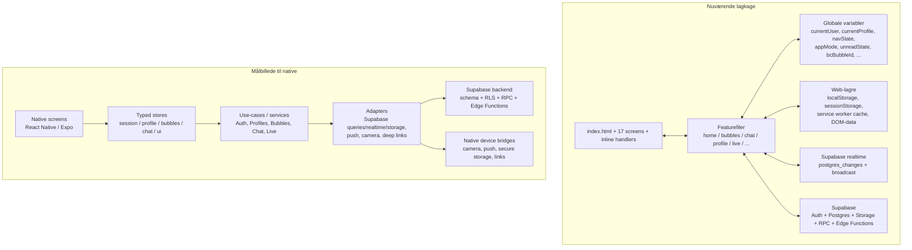
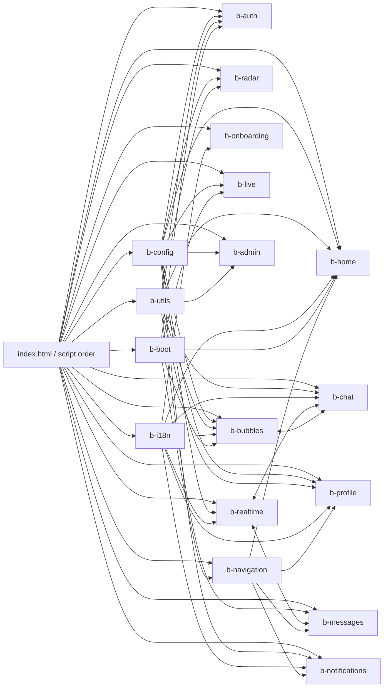
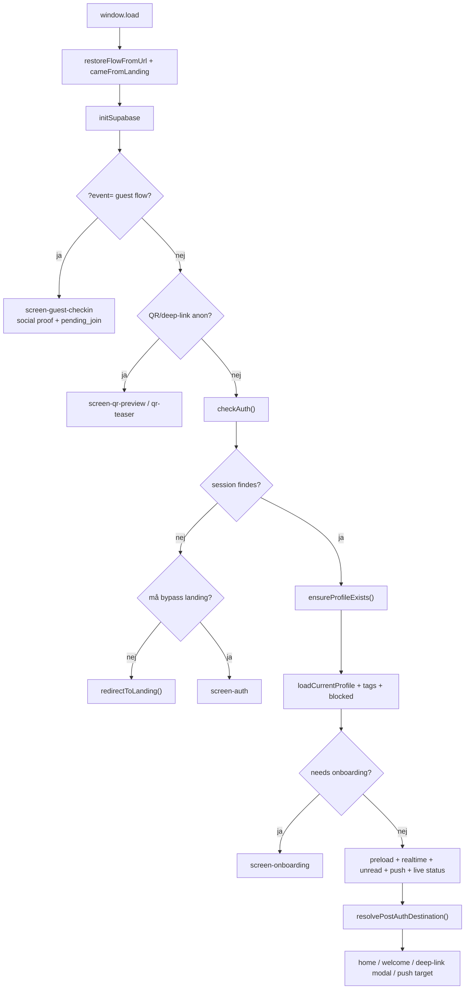
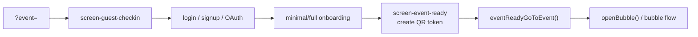

# Bubble arkitektur-review og native-readiness

## Executive summary

Jeg har gennemgået begge kodebaser i de to ZIP-arkiver — `bubble-prod-v8.17.26.zip` og `bubble-next-v8.29.zip` — som to snapshots af **samme grundarkitektur**, ikke to fundamentalt forskellige produkter. Den vigtigste konklusion er derfor ikke “hvilken build skal porteres?”, men:

**Bubble skal ikke porteres skærm for skærm. Den skal først oversættes til kontrakter: state, flows, writes, realtime-events og domæneansvar.**

Det mest centrale fund er dette:

- **Frontend-arkitekturen kan mappes næsten lossless fra repoerne.**
- **Backend-adfærden kan ikke mappes 100% lossless fra ZIP alene**, fordi Supabase-schema, RLS-policies, triggers, views, edge function-kode og bucket policies ikke ligger i repoet. Det betyder, at frontend-kontrakterne er tydelige, men backend-invarianter er stadig delvist infererede.

### Hovedkonklusioner

Bubble er i dag en **statisk multi-screen PWA** med:

- én stor `index.html` med **17 app-skærme**
- eksplicit script-load-order som fungerer som de facto modul-system
- ~20 runtime-JS-filer i next-build
- tung brug af **globale variabler**, DOM-state, `localStorage`, `sessionStorage` og direkte Supabase-kald
- Supabase som reel kerne for auth, data, realtime, storage og dele af push/check-in

Arkitekturen virker, men er **organisk og krydskoblet**. De største styrker og svagheder er tydelige:

### Det der virker godt og bør bevares

- **Supabase som backend-rygrad** er allerede et stærkt, genbrugeligt fundament.
- **Domænerne er faktisk synlige** i filstrukturen: auth, home, bubbles, chat, profile, live, notifications, realtime osv.
- **`dbActions`-mønstret** i `b-utils.js` er et rigtigt skridt mod et portabelt service-lag.
- **`appMode`, `navState`, `unreadState` og reducer-mønstrene** (`dmReduceMsg`, `bcReduceMsg`) er embryoner til en rigtig native state-arkitektur.
- **Next-buildens `bubble-smoke-tests-v5.html`** er et stærkt udgangspunkt for kontrakt-tests før native.

### Det der vil gøre en direkte native-port dyr og risikabel

- **State er spredt** over globals, DOM, local/session storage, Supabase og realtime shadow state.
- **Write paths er ikke centraliserede**. Samme ressource skrives fra mange moduler.
- **Realtime er funktionsrigt men komplekst**, med både `postgres_changes` og `broadcast`, plus reconnect- og foreground/background-logik.
- **Navigation og auth/deep-linking er reelle state machines**, men de er ikke formuleret som eksplicitte state machines.
- **UI, data og side effects lever i samme filer**, ofte i samme funktioner.
- **PWA-/browser-workarounds** fylder meget og skal ikke med over i native som implementation.

### Den objektive anbefaling

Den rigtige native-forberedelse er ikke “start et React Native-projekt og kopier UI’et”.
Den rigtige rækkefølge er:

1. **Frys nuværende kontrakter**: schema, writes, realtime, flows, deep links, unread-regler, onboarding-regler.
2. **Ekstrahér et portabelt kerne-lag** i web-koden: repositories/use-cases/store-kontrakter.
3. **Port først en vertikal slice**, ikke hele appen:
   - auth/session
   - minimal onboarding
   - deep-link join flow
   - home/radar
   - personprofil + save contact
   - DM chat

Bubble chat, live scanner, push og admin bør komme i de næste slices — ikke i første hug.

## Kodebase og arkitektur-baseline

### Korpus og størrelser

De to ZIP’er repræsenterer samlet et forholdsvis kompakt, men arkitektonisk tæt system.

| Build | Kodefiler | Kilde-linjer | Bemærkning |
|---|---:|---:|---|
| Prod v8.17.26 | 25 filer | 25.929 | 19 JS-filer, 2 HTML, 1 CSS, 2 MD, 1 JSON |
| Next v8.29 | 27 filer | 28.688 | 20 JS-filer, 3 HTML, 1 CSS, 2 MD, 1 JSON |

**Nettoforskel:** next er ca. **+2.759 linjer** større end prod, svarende til ca. **+10,6%**.

### Systemtype

Bubble er ikke en “Next.js app”, en “CRA app” eller en “bundlet SPA”.
Den er en **statically served multi-screen single-page PWA**, hvor runtime-arkitekturen defineres af:

- `index.html` script-rækkefølgen
- globale symboler i `window`-scope
- DOM-ID’er og `.screen`-sektioner
- direkte Supabase-adgang fra featuremoduler

Det ses direkte i `index.html`, hvor runtime-filerne lastes i fast rækkefølge, bl.a. `b-config.js`, `b-utils.js`, `b-auth.js`, `b-home.js`, `b-bubbles.js`, `b-profile.js`, `b-realtime.js`, `b-navigation.js` og til sidst `b-boot.js`. Det betyder, at **load order er en arkitekturafhængighed**, ikke kun et build-detail.

### Skærm-model

Der er **17 primære app-skærme** i `index.html`:

- `screen-loading`
- `screen-auth`
- `screen-onboarding`
- `screen-welcome`
- `screen-qr-preview`
- `screen-qr-teaser`
- `screen-social-proof`
- `screen-guest-checkin`
- `screen-event-ready`
- `screen-home`
- `screen-bubbles`
- `screen-notifications`
- `screen-person`
- `screen-bubble-chat`
- `screen-messages`
- `screen-chat`
- `screen-profile`

Det er en vigtig observation for native-planen: den nuværende app er i praksis en **screen-router med overlays**, ikke et komponenttræ med klar state-ejerskab.

### Fuld filinventar

#### Kerne-runtime

| Fil | Prod | Next | Rolle |
|---|---:|---:|---|
| `index.html` | 1801 | 1832 | App-shell, screens, script order, critical CSS, inline handlers |
| `landing.html` | 1025 | 1025 | Marketing/landing, sprogskift, cookie-banner, auth entry |
| `app.css` | 2294 | 3931 | Hele design-systemet, layout, responsive regler, PWA/UI-hacks |
| `manifest.json` | 33 | 33 | PWA-manifest |
| `sw.js` | 132 | 132 | Service worker, cache, push display, push navigation |
| `bubble-icons.js` | 68 | 68 | SVG icon set |
| `b-config.js` | 415 | 414 | Supabase init, globals, flow state, appMode, error logging |
| `b-utils.js` | 1139 | 1167 | UI helpers, modals, toasts, render helpers, `dbActions` |
| `b-navigation.js` | 358 | 374 | Router, nav state, back stack, screen hooks |
| `b-boot.js` | 975 | 975 | App boot, preload, deep link capture, analytics, event delegation |
| `b-auth.js` | 788 | 785 | Auth, OAuth, logout, post-auth routing, QR/profile sharing |
| `b-home.js` | 2452 | 2510 | Home/dashboard, unread-bobler, deep-link modals, personalization |
| `b-bubbles.js` | 2340 | 2340 | Discover, bubble CRUD, ownership/admin, QR/PDF, invites, reports |
| `b-chat.js` | 2456 | 2467 | Bubble chat, tabs, reactions, members, posts, file/GIF |
| `b-messages.js` | 355 | 365 | DM send, bulk-delete, unread state, file upload |
| `b-realtime.js` | 1285 | 1288 | Realtime hub, DM chat runtime, reconnect, conversation loaders |
| `b-profile.js` | 1667 | 1667 | Person/profile, saved contacts, settings, block/report, dashboard |
| `b-radar.js` | 490 | 496 | Radar UI, match scoring, filters, list/map |
| `b-live.js` | 1189 | 1189 | Live check-in, scanner, contact scanner, guest check-in |
| `b-notifications.js` | 669 | 687 | Aggregated notifications, push registration/toggle |
| `b-onboarding.js` | 1127 | 1128 | Minimal/full onboarding, tag picker, avatar repair |
| `b-admin.js` | 690 | 690 | Admin stats, reports, ban/unban, debug overlay |

#### Support, tests og docs

| Fil | Prod | Next | Rolle |
|---|---:|---:|---|
| `tag-data.js` | — | 240 | Tag-katalog, søgning og kategoriopslag |
| `bubble-smoke-tests-v5.html` | — | 928 | Browserbaseret smoke-test-harness mod Supabase |
| `ARCHITECTURE-LOG.md` | 336 | — | Arkitektur-log med native-readiness indsigter |
| `STRATEGI.md` | 527 | — | Strategi, forretningsmodel, native-tanker |
| `DESIGN-SYSTEM.md` | — | 224 | Design-system reference |
| `DESIGN-GUIDE.md` | — | 397 | UI/design guidelines |
| `CNAME` | 1 | — | Hosting/domæne-peger i prod-zip |

### Nuværende lagkage kontra målbillede



### Arkitekturens vigtigste strukturelle fund

- **Der er ingen package manager eller bundler i repoet.** Ingen `package.json`, ingen build-pipeline, ingen typed imports. Det gør script-rækkefølge og globals til runtime-kontrakter.
- **Koden er allerede semantisk opdelt i domæner**, men ikke teknisk isoleret.
- **`b-config.js` er det reelle fundament**: det ejer Supabase-klienten, auth-globals, flow state og `appMode`.
- **`b-utils.js` er appens skjulte shared kernel**: modals, toasts, render-helpers og `dbActions`.
- **`b-navigation.js` er router/state-koordinator**, men stadig DOM-centreret og screen-ID-baseret.
- **`b-boot.js` er orkestratoren**, hvor boot-sekvens, preload, deep links, analytics og PWA-opførsel mødes.

## Funktions- og domænekort

### Fuld featuremap med native-readiness

Skalaen her er **1–5**, hvor:

- **5** = direkte portabel logik/kontrakt
- **4** = godt portabel, men kræver ny UI
- **3** = blandet; logik kan bruges, implementation skal skæres fri
- **2** = tungt DOM/browser/PWA-præget
- **1** = bør ikke porteres som implementation

| Feature | Primære filer | Data/afhængigheder | Realtime | Native-readiness | Kommentar |
|---|---|---|---|---:|---|
| Auth, session, logout, OAuth | `b-auth.js`, `b-config.js`, `b-boot.js` | `profiles`, `push_subscriptions`, Supabase Auth | Indirekte | 4 | Domænet er godt; nuværende implementation er web/deep-link-tung |
| Minimal/full onboarding | `b-onboarding.js`, `tag-data.js` | `profiles`, `custom_tags`, storage bucket | Nej | 3 | Regler kan porteres; UI og DOM-flow skal omskrives |
| Welcome/first-run | `b-auth.js`, `b-onboarding.js`, `b-home.js` | `localStorage` flags | Nej | 2 | Behaviour skal bevares, implementation skal erstattes |
| Home/dashboard | `b-home.js` | `profiles`, `bubble_members`, `bubbles`, `saved_contacts` | Ja, indirekte | 3 | Meget central, men stærkt blandet UI/data/state |
| Radar og match | `b-radar.js`, `b-profile.js`, `b-home.js` | `profiles`, `bubble_members` | Delvist | 4 | Matchlogik er portabel; web-radarvisningen er det ikke |
| Personprofil og save contact | `b-profile.js` | `profiles`, `saved_contacts`, `profile_views`, `reports`, `blocked_users` | Indirekte | 4 | Stærk kandidat til tidlig port |
| Discover og bubble-lister | `b-bubbles.js`, `b-home.js` | `bubbles`, `bubble_members`, `bubble_upvotes` | Delvist | 3 | Domænet kan porteres; web-rendering er tung |
| Bubble CRUD, ownership, admin calls | `b-bubbles.js`, `b-utils.js` | `bubbles`, `bubble_members`, `bubble_invitations` | Broadcast | 3 | Bør portes via service/use-case-lag, ikke via nuværende UI |
| Bubble chat | `b-chat.js`, `b-realtime.js` | `bubble_messages`, `bubble_members`, `bubble_posts`, reaktioner | Ja | 3 | Funktionelt rigt, men komplekst og stærkt koblet |
| DM chat | `b-realtime.js`, `b-messages.js` | `messages`, storage bucket | Ja | 4 | God første native messaging-slice |
| Notifications center | `b-notifications.js`, `b-home.js`, `b-messages.js` | afledt fra mange tabeller | Ja | 3 | Semantik er vigtig; implementation bør gøres eventbaseret |
| Push-notifikationer | `b-notifications.js`, `sw.js`, `b-boot.js` | `push_subscriptions`, SW, Notification API | Ja | 2 | Feature skal bevares; PWA-implementation skal droppes |
| Live check-in/out | `b-live.js`, `b-utils.js` | `bubble_members`, edge function `checkin` | Ja | 3 | Dataflow er portabelt; kamera/scanner-del skal redesignes |
| QR scanner og connect-scanner | `b-live.js` | `qr_tokens`, `qr_scans`, `guest_checkins` | Broadcast + DB | 2 | Native er bedre her, men nuværende webimplementering er ikke portabel |
| Admin, debug, stats | `b-admin.js` | `reports`, `profiles`, `error_log`, analytics | Ja | 2 | Lav prioritet i første native-fase |
| PWA shell, cache, install, update banner | `index.html`, `sw.js`, `b-boot.js` | manifest, cache | Ja | 1 | Erstat med native app shell og OTA/version-flow |

### Domænematrix for moduler

| Modul | Eget ansvar | Læser især | Skriver især | Kommentar |
|---|---|---|---|---|
| `b-config.js` | Supabase init, globals, flow state, appMode | — | `error_log` | Reelt fundament |
| `b-utils.js` | Shared UI helpers + `dbActions` | `currentUser`, `currentProfile` | Mange kerne-writes | Burde opdeles i UI-utils og data-services |
| `b-navigation.js` | Nav-stack og screen hooks | `navState`, screen IDs | DOM, history | Naturlig kandidat til total rewite i native |
| `b-boot.js` | Boot, preload, capture af deeplinks | alt | `analytics` | Orkestrator mere end domæne |
| `b-auth.js` | Auth og post-auth routing | flow flags, navigation | `profiles`, `push_subscriptions`, `reports`, `qr_tokens` | State machine uden eksplicit model |
| `b-home.js` | Dashboard, quick edits, deep-link modal | auth/profile, unread, bubbles | `profiles` | Skriver profil fra homeskærm — hotspot |
| `b-bubbles.js` | Discover, bubble management | auth/profile/chat context | `bubbles`, `bubble_members`, `bubble_upvotes`, invites | Stor domænefil |
| `b-chat.js` | Bubble chat runtime | bubble/chat/live state | bubble chat-tabeller | Tung featurefil, mange ansvar |
| `b-realtime.js` | Global realtime + DM runtime | currentUser, currentLiveBubble | `messages` read receipts | Meget central runtime-fil |
| `b-messages.js` | DM send/delete + unread | currentChatUser mm. | `messages`, storage | Lille men vigtig |
| `b-profile.js` | Person/profile/settings/dashboard | auth/profile/radar | `profiles`, `saved_contacts`, `reports`, `blocked_users` | Domænemæssigt relativt klart |
| `b-radar.js` | Radarvisninger og scoring | profiles/match-data | ingen writes | God kilde til portabel logik |
| `b-live.js` | Live mode og scanner | auth/bubble context | `guest_checkins`, `qr_scans` + edge function | Browser- og device-tung |
| `b-notifications.js` | Aggregation og push | mange tabeller | `push_subscriptions`, invitation accept/decline | Notifikationer er afledt data |
| `b-onboarding.js` | Setup og tagvælger | profile/flow | `profiles`, `custom_tags`, storage | Kandidat til clean port efter refactor |
| `b-admin.js` | Admin og debug | currentProfile role | `profiles` | Lav native-prio |

### Afhængighedsgraf på modulniveau



Den vigtigste læsning af grafen er ikke de enkelte pile, men mønstret:

- **`b-config`, `b-utils` og `b-i18n` er fundamentet**
- **`b-boot` og `b-navigation` orkestrerer hele appen**
- **`b-realtime` og `b-chat` er runtime-tunge knudepunkter**
- **`b-home`, `b-bubbles`, `b-chat`, `b-profile` er de store feature-klumper**

## Data-, state- og realtime-kort

### Hvor sandheden bor i dag

| State / sandhed | Primær ejer | Persistens | Læses af | Risiko |
|---|---|---|---|---|
| `sb`, `currentUser`, `currentProfile` | `b-config.js` | in-memory + Supabase Auth | næsten alle | Global coupling |
| Flow flags (`pending_contact`, `pending_join`, `event_flow`, `post_tags_destination`) | `b-config.js` (`flowGet/Set`) | `localStorage` m. TTL | auth, boot, onboarding, bubbles | Skjult state machine |
| `appMode` / `currentLiveBubble` | `b-config.js` | in-memory | home, live, chat, utils, realtime | Legacy aliaser og dobbeltkilder |
| `navState`, `_navStack`, `_activeScreen` | `b-navigation.js` | in-memory + browser history | navigation, auth, profile, chat | Web-sporbar, ikke portabel |
| `unreadState.dm/notif` | `b-messages.js` | in-memory | messages, realtime, home, notifications | Rimelig god centralisering |
| `_bubbleUnreadSet`, `_myBubbleMemberIds` | `b-home.js` | in-memory | home, realtime, chat | Egen unread-verden for bubble chat |
| `bcBubbleId`, `bcBubbleData`, `bcSubscription` | `b-chat.js` | in-memory | chat, navigation, live | Tæt coupled til skærm-livscyklus |
| `currentChatUser`, `currentChatName`, `chatSubscription` | `b-realtime.js` | in-memory | messages, realtime, navigation | Blander feature og runtime |
| `currentPerson`, `proxAllProfiles`, `savedContactIdsCache` | `b-profile.js` | in-memory | profile, home, radar | Blandet data og UI-state |
| Onboarding selections | `b-onboarding.js` | in-memory + delvist `localStorage` | auth/onboarding/profile | Kan gøres meget renere |
| Home customization prefs | `b-home.js` | `localStorage` (`bubble_hs_prefs`) | home | Fint som UI-preference |
| Sprogvalg | `b-i18n.js` | `localStorage` (`bubble_lang`) | hele appen | God kandidat til direkte port |
| `bb_route` | `b-chat.js` / `b-navigation.js` | `sessionStorage` | nav + bubble chat | Workaround for back-nav |
| `bubble_came_from_landing` | `b-boot.js` / `b-auth.js` | `sessionStorage` | auth/boot | PWA-specifikt workaround |
| SW cache/version | `sw.js` | Cache Storage | boot | Skal ikke porteres som implementation |

### `localStorage` og `sessionStorage` nøgler

De vigtige observerede nøgler er:

- `bf_*` flow keys via `flowSet/flowGet` (TTL-wrap)
- `bubble_lang`
- `bubble_hs_prefs`
- `bubble_notifs_seen`
- `bubble_stars`
- `bubble_welcome_card_dismissed`
- `bubble_welcomed`
- `bubble_selected_interests`
- `bubble_cookie_ok`
- `bubble_landing_lang`
- `bb_route`
- `bubble_came_from_landing`
- `event_greeting`
- `event_greeting_id`

Det er en vigtig native-observation:
**Funktionel state og UI-preference-state er blandet i browser storage.**
I native bør det splittes i:

- secure/session storage
- persisted UI prefs
- ephemeral navigation state
- backend truth

### Supabase-overflade

Ud fra frontend-koden kan følgende backendressourcer observeres.

#### Tabeller

| Ressource | Funktion i produktet | Skrive-ejere |
|---|---|---|
| `profiles` | Brugeridentitet, profilindhold, rolle, anonimitet | admin, auth, home, onboarding, profile, utils |
| `bubbles` | Top-level bobler/events/sub-bobler | bubbles, profile, utils |
| `bubble_members` | Medlemskab, pending status, check-in/out, unread marker | bubbles, chat, notifications, profile, utils |
| `bubble_messages` | Bubble chat beskeder | chat, utils, bubbles (cascade delete) |
| `bubble_message_edits` | Historik på redigeringer | chat |
| `bubble_message_reactions` | Reaktioner på bubble-messages | chat |
| `bubble_posts` | Opslag/announcements | utils |
| `bubble_post_reactions` | Reaktioner på opslag | utils |
| `bubble_invitations` | Invitationer til bobler | bubbles, profile, utils |
| `bubble_upvotes` | “Anbefal” / upvotes | bubbles |
| `messages` | Direkte beskeder | messages, realtime, utils |
| `saved_contacts` | Gemte personer | profile, utils |
| `profile_views` | Profilvisninger | profile |
| `blocked_users` | Blokeringer | profile |
| `reports` | Brugerrapporter og feedback | auth, profile, utils |
| `push_subscriptions` | Push endpoints + nøgler | auth, notifications |
| `qr_tokens` | Korte QR tokens | auth, utils |
| `qr_scans` | Scanner-log | live |
| `guest_checkins` | Gæstetjek ind via QR | live |
| `custom_tags` | Brugeroprettede tags | onboarding |
| `analytics` | App analytics queue flush | boot |
| `error_log` | Klientfejl med klientstate | config |

#### Storage bucket, RPC’er og edge functions

| Resource | Rolle | Observeret brug |
|---|---|---|
| `bubble-files` bucket | Avatarer, vedhæftninger, bubble-ikoner | auth, onboarding, chat, messages, bubbles |
| RPC `get_latest_bubble_msg_times` | Bubble unread-beregning | home |
| RPC `count_unique_members` | Event/info metrics | chat |
| RPC `count_new_unique_members` | Event/info metrics | chat |
| Edge function `checkin` | Live check-in | live |
| Edge function `reset-test-user` | Admin testværktøj | admin |

### Write-fanout og hotspots

Det mest arkitektonisk vigtige er ikke bare **hvor der skrives**, men **hvor mange steder samme sandhed skrives fra**.

| Ressource | Antal skrivemoduler | Diagnose |
|---|---:|---|
| `profiles` | 6 | Største write-hotspot; profil sandhed spredt over auth/home/onboarding/profile/admin/utils |
| `bubble_members` | 5 | Medlemskab, unread, live, pending, roller og check-in er samlet i én tabel men skrives mange steder |
| `bubble-files` | 5 | Uploadmønstre gentages flere steder |
| `bubble_invitations` | 3 | Invitationslogik delvist centraliseret, delvist spredt |
| `bubble_messages` | 3 | Chat-sandhed er delt mellem utils/chat/bubbles |
| `bubbles` | 3 | Bubble CRUD sker både centralt og featurelokalt |
| `messages` | 3 | DM skrives både via utils og direkte fra DM/realtime-keystones |
| `reports` | 3 | Rapportering/feedback bor flere steder |
| `push_subscriptions` | 2 | Logout og push-toggle krydser auth/notifications |
| `qr_tokens` | 2 | Både auth-flow og utils/create QR |

Det er her native-risikoen ligger:
**samme domæneobjekt = flere write-indgange = sværere lossless port**.

### Realtime-kort

Bubble har ikke ét realtime-system; den har **tre lag realtime**:

1. **global app-realtime** i `b-realtime.js`
2. **bubble-lokal realtime** i `b-chat.js`
3. **broadcast workarounds** for tværbruger-events der ikke nemt kan løses via RLS-filtrerede `postgres_changes`

#### Realtime events tabel

| Kanal | Type | Ressource | Formål |
|---|---|---|---|
| `rt-live-bubble-{bubbleId}` | `INSERT`/`UPDATE` | `bubble_members` | Live member changes i aktiv boble |
| `rt-messages-{userId}` | `INSERT`/`UPDATE`/`DELETE` | `messages` | DM badges, previews og reaktionsload |
| `rt-members-{userId}` | `INSERT`/`UPDATE`/`DELETE` | `bubble_members` | Medlemskabsændringer, live-kort, pending/active |
| `rt-bubbles-deleted-{userId}` | `DELETE` | `bubbles` | Fjerne slettede bobler |
| `rt-bubble-msgs-{userId}` | `INSERT` | `bubble_messages` | Bubble unread i nav/hjem |
| `rt-invites-{userId}` | `INSERT` | `bubble_invitations` | Badge og notification refresh |
| `rt-saved-{userId}` | `INSERT` | `saved_contacts` | Saved-you notifikationer |
| `checkin-notify-{userId}` | `broadcast` | — | Direkte checkin-notify til bruger |
| `member-notify-{userId}` | `broadcast` | — | `approved`, `new_member`, `join_request`, `invite`, `ownership`, `admin` |
| `dm-notify-{userId}` | `broadcast` | — | Conversation deleted sync |
| `bc-{bubbleId}` | `INSERT`/`UPDATE`/`DELETE` | bubble chat-tabeller | Bubble chat som lokal realtime runtime |
| `dmChannelName()` | `broadcast` + `INSERT` | `messages` | aktiv DM tråd: typing, read receipts, message inserts |
| `admin-debug-errors` | `INSERT` | `error_log` | Debug overlay for admin |

### Flowkort





### Implicit logik og workarounds der skal dokumenteres før native

| Mønster | Hvorfor det findes | Hvor det bor nu | Native-aktion |
|---|---|---|---|
| `bubble_came_from_landing` i `sessionStorage` | Undgå auth↔landing reload-loop | boot/auth | Drop implementation, bevar intention |
| Flow flags med TTL i `localStorage` | Overleve OAuth redirect og langsomt net | config/auth/boot | Erstat med eksplicit deep-link/session intent store |
| `ensureProfileExists()` | OAuth-brugere kan mangle profilrække | auth | Bevar som backend/bootstrap use-case |
| `goToThen()` med double `requestAnimationFrame` | Erstatte skrøbelige `setTimeout` navigation races | navigation | Erstat med native navigation callbacks |
| `_navVersion` | Stale render-cancellation | config/navigation/home/notifications | Bevar idéen i async viewmodels |
| `bb_route` i `sessionStorage` | Genskabe bubble-chat kontekst ved back | chat/navigation | Erstat med typed navigation params |
| Update-før-upsert i check-in | Mere RLS-venligt end blind upsert | utils | Bevar som repository-policy |
| Broadcast-kanaler som RLS-workaround | Tværbruger-notify uden direkte row access | realtime/live/bubbles/chat | Dokumentér og redesign som event-katalog |
| Bubble unread via RPC | Billigere end mange lokale queries | home | Bevar semantik, flyt til service layer |
| Avatar “repair” til Supabase storage | Gøre OAuth-avatarer stabile og kontrollerede | onboarding/auth | Bevar use-case, portér device-uafhængigt |
| SW version handshake | Vise update-banner ved PWA mismatch | boot/sw | Drop implementation, behold release-aware UX i native |

## Differential analyse mellem prod og next

### Overordnet vurdering

De to builds deler samme runtime-arkitektur, samme Supabase-backend, samme skærmstruktur og næsten samme modulopdeling.
**Forskellen er evolution, ikke revolution.**

Det betyder praktisk:

- native-udtrækket kan baseres på **én samlet arkitekturmodel**
- prod og next skal ses som **to snapshots af samme domæne**
- next er den bedste “seneste kode-sandhed”
- prod indeholder dog væsentlige **strategi-/arkitektur-dokumenter**, som next ikke har med

### De vigtigste forskelle

| Område | Observation | Betydning |
|---|---|---|
| Kernen | Samme PWA, samme script order, samme domænefiler | Ingen grund til to native-målarkitekturer |
| CSS/UI-system | `app.css` vokser kraftigt i next (+1637 linjer) | Next har især design-system og visuel standardisering |
| Tag-system | `tag-data.js` findes i next, ikke i prod-zip | Next gør tag-kataloget eksplicit |
| Test | `bubble-smoke-tests-v5.html` findes kun i next | Stor gevinst for regression/contract tests |
| Docs | `ARCHITECTURE-LOG.md` og `STRATEGI.md` findes i prod, ikke i next | Viden er splittet mellem branches |
| Notifications/nav | Next tilføjer notif tray-funktioner og nav-indikator | Små men rigtige UX/systemforbedringer |
| Home | Next ændrer greeting-rendering, fade-in, badge-opførsel | Primært UX- og polish-forbedringer |
| Runtime-logik | Kun moderate diffs i JS-filer | Backend-kontrakter ser stabile ud |

### En vigtig repo-anomali

Prod-zippen refererer til `tag-data.js` i både `index.html` og `sw.js`, men filen findes **ikke** i selve prod-arkivet.

Det betyder én af to ting:

- enten er prod-zippen **ikke komplet**
- eller også havde prod et **latent deploy-/packaging-problem**

For lossless arkitekturekstraktion betyder det:
**next-builden er mere troværdig som kildesandhed for runtime-filerne end prod-zippen alene.**

### Mest ændrede filer

| Fil | Ændring | Vurdering |
|---|---:|---|
| `app.css` | +1637 | Design-system, utility-klasser, visuel konsolidering |
| `tag-data.js` | +240 (ny) | Eksplicit tag-katalog |
| `bubble-smoke-tests-v5.html` | +928 (ny) | Test-harness |
| `b-home.js` | +58 | Home-polish og mindre logikændringer |
| `b-utils.js` | +28 | Shared helpers / write layer lidt udvidet |
| `b-notifications.js` | +18 | Notif tray/push polish |
| `b-i18n.js` | +18 | Flere keys/tekster |
| `b-navigation.js` | +16 | Nav indicator og mindre navigation polish |
| `b-chat.js` | +11 | Små runtimejusteringer |
| `b-messages.js` | +10 | Små DM/UI-justeringer |

### Objektiv konklusion på prod vs next

Hvis målet er native-forberedelse, skal du ikke vælge “prod eller next” som to alternative retninger.
Du skal gøre dette:

- bruge **next som kode-snapshot for runtimeadfærd**
- bruge **prod-dokumenterne som strategisk/arkitektonisk kontekst**
- behandle differencerne som **inkrementelle forbedringer**, ikke separate platforme

## Native-readiness og migrationsprioritet

### Native-readiness efter domæne

| Domæne | Readiness | Estimeret port-indsats | Risiko | Anbefaling |
|---|---:|---|---|---|
| Supabase backend-kontrakter | 5/5 | Lav | Lav | Portér som backend-fundament |
| i18n og tag taxonomy | 5/5 | Lav | Lav | Portér tidligt |
| Match scoring og forretningsregler | 4/5 | Lav-mellem | Lav | Ekstrahér til ren servicekode |
| Auth/session | 4/5 | Mellem | Mellem-høj | Rebuild som eksplicit state machine |
| Person/profile/save contact | 4/5 | Mellem | Mellem | God første native domænepakke |
| DM chat | 4/5 | Mellem | Mellem | God første messaging-slice |
| Home/radar | 3/5 | Mellem-høj | Mellem | Byg mindre, renere variant først |
| Bubble CRUD/discover | 3/5 | Mellem-høj | Mellem | Portér efter foundation |
| Notifications center | 3/5 | Mellem | Mellem-høj | Definér eventkatalog først |
| Bubble chat | 3/5 | Høj | Høj | Portér som anden/trejde slice |
| Live check-in logic | 3/5 | Mellem | Høj | Domænet kan porteres; scanner senere |
| Scanner/camera flows | 2/5 | Høj | Høj | Byg native-first implementation, ikke port |
| Admin/debug | 2/5 | Lav-mellem | Lav | Senere |
| Navigation implementation | 1/5 | Mellem | Mellem | Erstat helt |
| Service worker/PWA shell | 1/5 | Lav | Lav | Drop implementation helt |

### Hvad der skal porteres, refaktoreres og droppes

#### Portér først

- Supabase-baseret backendmodel
- `dbActions`-kontrakterne som use-cases/repositories
- i18n-nøgler og tag-katalog
- match scoring og unread-semantik
- saved contacts / profile / person / DM-domæner
- smoke-test-scenarier som kontrakt-tests

#### Refaktorer før port

- auth/deep-link/post-auth routing
- state ownership
- realtime manager
- notification aggregation
- profile update paths
- bubble membership write flows
- file-upload abstractions
- navigation params og back-behaviour

#### Drop eller erstat

- service worker cache-logik
- browser history/back stack som implementation
- inline `onclick` og string-rendered UI som mønster
- PWA landing/auth workarounds
- `sessionStorage` som navigationstilstand
- viewport/PWA-specifikke hacks
- direkte DOM-cache som state-shape

### Anbefalet første native vertical slice

Den første native slice bør være den mindste pakke, der samtidig verificerer jeres kerne-loop og jeres nye fundament.

**Mit konkrete forslag:**

1. **Auth + session**
2. **Minimal onboarding**
3. **Deep-link join intent**
4. **Home/radar i forenklet form**
5. **Personprofil**
6. **Save contact**
7. **DM chat**

Denne slice er bedre end at starte med bubble chat og scanner, fordi den:

- tester jeres virkelige kerneværdi: opdage person → forstå match → gem kontakt → fortsæt samtale
- rammer høj værdi med lavere web/PWA-baggage
- tvinger jer til at få session/state/navigation/realtime rigtigt tidligt
- undgår at første native sprint drukner i kamera, QR, live presence og PWA-erstatninger

### Ti konkrete implementation tasks

1. **Eksportér autoritative backend-kontrakter**
   - schema
   - RLS
   - triggers
   - RPC’er
   - edge functions
   - buckets/policies

2. **Skriv en faktisk arkitektur-spec i repoet**
   - state ownership
   - route map
   - write map
   - realtime event catalog
   - source-of-truth matrix

3. **Gør `dbActions` til rigtig kontrakt**
   - ét repository/use-case-lag
   - typed return shape
   - ingen nye direkte writes udenom

4. **Reducer write-fanout**
   - især `profiles`
   - især `bubble_members`
   - især `messages` og `bubble_messages`

5. **Formaliser auth/deep-link state machine**
   - `unauthenticated`
   - `authenticating`
   - `needs_onboarding`
   - `ready`
   - `pending_intent`
   - `in_event_flow`

6. **Formaliser realtime event-katalog**
   - `MessageInserted`
   - `MessageUpdated`
   - `BubbleMemberInserted`
   - `InvitationInserted`
   - `SavedContactInserted`
   - `CheckinBroadcast`
   - osv.

7. **Skriv kontrakt-tests ud fra smoke-harness og flows**
   - login
   - signup
   - save contact
   - join bubble
   - DM send/read
   - invitation accept/decline
   - check-in semantics

8. **Byg native app shell med typed stores**
   - session store
   - profile store
   - conversations store
   - bubbles store
   - ui/navigation store

9. **Implementér vertical slice**
   - auth
   - onboarding
   - home/radar
   - person
   - save contact
   - DM chat

10. **Planlæg anden slice**
   - bubble chat lite
   - notifications
   - push
   - event join/open bubble
   - først derefter scanner/live

### Tidslinje-roadmap

```mermaid
gantt
    dateFormat  YYYY-MM-DD
    title Bubble native-readiness roadmap

    section Kontrakter og arkæologi
    Schema, RLS, triggers, RPC, functions eksport    :a1, 2026-05-11, 7d
    Arkitektur-spec: state, writes, realtime, flows  :a2, after a1, 7d

    section Web-stabilisering
    Centralisering af writes til repositories        :b1, 2026-05-25, 14d
    Auth/deeplink state machine specifikation        :b2, 2026-05-25, 10d
    Realtime event-katalog og cleanup-plan           :b3, 2026-05-25, 10d

    section Native foundation
    Native shell + session/profile stores            :c1, 2026-06-15, 7d
    Auth + onboarding + home/radar/person            :c2, after c1, 14d
    Save contact + DM chat                           :c3, after c2, 14d

    section Udvidelse
    Notifications + push                             :d1, 2026-07-20, 14d
    Bubble chat lite                                 :d2, after d1, 14d
    Live/scanner/check-in                            :d3, after d2, 14d
```

## Open questions og begrænsninger

Der er nogle ting, som **ikke** kan mappes lossless fra ZIP’erne alene, og som skal hentes før I låser native-arkitekturen helt:

### Ikke specificeret i repoerne

- Supabase **schema-dump**
- RLS policies
- database triggers
- views/materialized views
- RPC-definitioner
- edge function-kilde for:
  - `checkin`
  - `reset-test-user`
- bucket policies for `bubble-files`
- evt. push/VAPID backend-konfiguration
- evt. server-side push-triggers uden for frontend-repoet

### Sådan bør det hentes

- **Schema og policies:** fuldt dump af public schema inkl. `pg_policies`, triggers og functions
- **RPC’er:** SQL-definitioner for de observerede RPC’er
- **Edge functions:** kildekode eller separat repo/export
- **Storage policies:** bucket-konfiguration og RLS for uploads/downloads
- **Prod-verifikation:** tjek live deploy for manglende `tag-data.js` i prod-zippen

### Hvad det betyder for denne rapport

Denne review er **meget tæt på lossless på frontend- og runtime-siden**:
- filstruktur
- features
- modulansvar
- state
- writes
- realtime
- flowlogik
- workarounds
- teknisk gæld
- native prioritet

Men den er **ikke 100% lossless på backend-kontraktniveau**, før Supabase-laget eksporteres autoritativt.

Den rigtige næste beslutning er derfor ikke “skal vi gå native?” men:

**“Hvilke web-kontrakter skal vi fryse og gøre eksplicitte, før vi bygger første native slice?”**

Det korte svar er:

- fryse **schema**
- fryse **write paths**
- fryse **realtime event catalog**
- fryse **auth/deep-link state machine**
- fryse **core user journeys**

Når de fem ting er eksplicitte, kan I bygge native uden at miste Bubble undervejs.